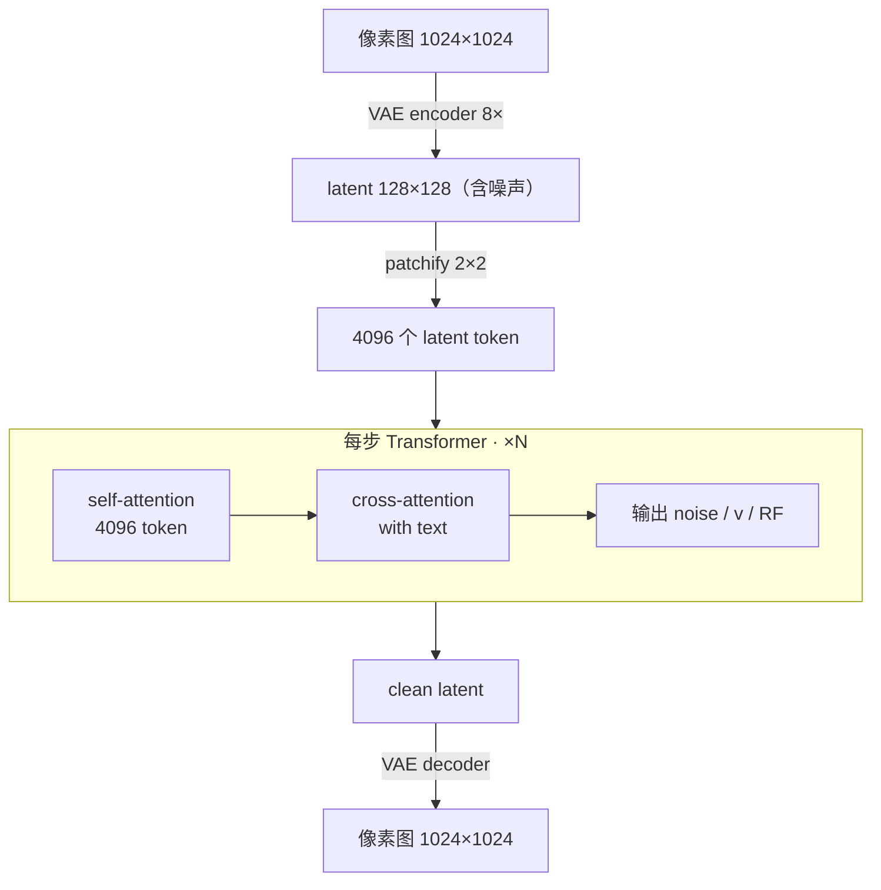

# DiT

DiT (Diffusion Transformer) 把扩散模型里的去噪网络从 U-Net 换成 Transformer——William Peebles & Saining Xie 2022 年提出[^1]。**论文证明 Transformer 不仅能替代 U-Net，scaling 行为还更好**（同算力下越大越好），由此成为现代 T2I / T2V 主干的事实标准——FLUX、Stable Diffusion 3、[[Qwen-Image-2.0]]、Sora 都基于 DiT 思路。

## DiT vs 传统 Diffusion

DiT 不是新的 diffusion 范式——**diffusion 过程本身完全没变**，只是把每步去噪那个神经网络从 **U-Net** 换成了 **Transformer**。

| 维度 | 传统 Diffusion (SD 1.x/2.x, DALL-E 2) | DiT-based (SD3, FLUX, Qwen-Image) |
|---|---|---|
| **去噪主干** | **U-Net** (CNN + 跳跃连接) | **Transformer** |
| Conditioning 注入 | cross-attention | AdaLN-Zero / 同序列 self-attn (MMDiT) |
| Scaling | <1B 表现良好，>1B 增益乏力 | **持续 scale 到 20B+** |
| 长 latent 序列 | O(n) 卷积友好 | O(n²) attention 瓶颈 |
| 推理优化 | 卷积成熟 (cuDNN) | attention 优化 (FlashAttention) |
| 用户视角 | 同样的 prompt → 出图接口 | 完全相同——只是质量更好 |

> [!note] 不是 DiT 必然带来的进步
> 同期还发生了：VAE 升级（Wan2.1-VAE）、text encoder 升级（CLIP → T5 → LLM/VLM）、训练目标演进（ε → v → rectified flow）。这些**理论上 U-Net 也能用**，但因为时间上和 DiT 一起出现，常被误认为是 DiT 自带特性。**DiT 的核心贡献只是"换个主干"**——和 [[ViT]] 替换 CNN 是同一个 scaling 故事。

## Mechanism

> [!note] 先解释一个关键术语：**latent**
> "Latent" 直译 "潜在的"，在 ML 里指**模型自己学到的、压缩过的中间表示**——既不是原始像素也不是最终输出，是一个"草稿空间"。
>
> **类比**：电影剪辑师不直接动 4K 原片，先转成 720p 代理片，在代理片上做剪辑、特效，最后渲染回 4K 输出。代理片 = latent；剪辑师 = DiT；最终渲染 = VAE decoder。
>
> 关键性质：(1) 比像素小很多（128×128 vs 1024×1024，~64× 算力节省）；(2) 仍保留所有人眼能感知的信息；(3) 是"机器内部语言"——你打开 latent tensor 看里面的数字什么都看不出。

DiT 不直接处理像素——先用 VAE 把图像压到 latent 空间（典型 8× 压缩：1024×1024 → 128×128），DiT 在 latent 上做 N 步去噪（典型 20–50 步），最后 VAE decoder 还原回像素。

> [!note] AdaLN-Zero：DiT 的 conditioning 巧思
> 原 DiT 的关键贡献之一是 **AdaLN-Zero**——把 timestep + class label 通过自适应 LayerNorm 注入每一层，且初始化为零（让网络从 identity 开始训）。比 cross-attention 更高效，至今仍被 SD3 / FLUX 沿用[^1]。

## 关键变种：MMDiT

DiT 原版的"text 通过 cross-attention 注入"路线，2024 年被 **MMDiT** 取代：

| 路线 | 文本和图像怎么融合 | 代表 |
|---|---|---|
| 原版 DiT | 图像 token self-attn；text 通过 cross-attn 单向注入 | DiT (2022)、PixArt-α |
| **MMDiT** (Multi-Modal DiT) | 文本 token 和图像 token **拼到同一个 self-attn 序列里互相看**，平等融合 | Stable Diffusion 3、FLUX、[[Qwen-Image]] / [[Qwen-Image-2.0]] |

MMDiT 的提升来自"双向"——文本可以根据当前图像状态调整，图像也能根据文本细节微调。

代表模型尺寸：

| 模型 | DiT 主干参数 | text encoder |
|---|---|---|
| Stable Diffusion 3 | 2-8B 多档 | CLIP + T5-XXL |
| FLUX.1 dev | ~12B | CLIP + T5-XXL |
| FLUX.2 dev | ~12B (推测) | (升级版 text encoder) |
| Qwen-Image (v1) | 20B MMDiT | frozen Qwen2.5-VL |
| **[[Qwen-Image-2.0]]** | **7B MMDiT** | frozen Qwen3-VL 8B |

## 推理特性与加速路径

DiT 的推理 profile 和 LLM 完全不同。理解这部分有助于把握为什么 [[Multimodal Inference Considerations]] 里把 T2I / UFM 划成独立 profile。

### 为什么 LLM 风格的 KV Cache 不适用

| 维度 | LLM autoregressive decode | DiT 去噪 |
|---|---|---|
| 序列长度 | 1 → 2 → 3 → ...（增长） | **固定**（如 4096 token，N 步内不变） |
| 每步只算 | 新 token 的 K/V | **所有 token** 的 K/V 都重新算 |
| 过去 K/V 是否变 | 不变 → 可缓存 | 输入是含噪 latent，**每步噪声水平不同 → K/V 全刷** |
| 算力特性 | memory-bound | **compute-bound** |

所以"把上一步的 image-token K/V 留着这一步用"——逻辑上行不通。

### 主瓶颈在哪：FLOPs 分布（实证数据）

要选对加速路径，先看算力实际花在哪。**MMDiT 单步 forward 的 FLOPs 主要在 image token 自己的 attention + FFN**，text 相关计算 < 2%。

**DiTFastAttn (NeurIPS 2024) 实测**[^2]：在 PixArt-Σ-2K (2048×2048) 生成上砍 76% attention FLOPs → **1.8× 端到端加速**。倒推 attention 占总算力比例：

| 输出分辨率 | image token 数 | image-image attention 算力占比 | image FFN 占比 | text 相关占比 |
|---|---|---|---|---|
| 1024² | 4,096 | ~35% | ~50% | <2% |
| 2048² | 16,384 | **~58%**（实测倒推） | ~30% | <0.5% |
| 4096² | 65,536 | ~80% | ~15% | <0.1% |

**两个关键观察**：

- **分辨率越高，attention 越主导**——O(N²) vs FFN 的 O(N)，比例随分辨率单向漂移
- **text 路径占比由 token 比例决定**——text len ÷ (text + image) 的上限就是 text 算力上限。1024² 已经只剩 ~1.2%，2K 更不到 0.5%

> [!warning] Text K/V cache 在 MMDiT 不是主优化
> 这意味着把 text token 的 K/V "算一次缓存 N 步" 在 MMDiT 里**实质收益 < 2%**——和 LLM 的 KV cache 节省内存带宽完全不是同一量级。**真正的"text cache" 大头在 text encoder 自己**（T5-XXL 11B / Qwen3-VL 8B 跑 1 次 vs 28 次），那个节省巨大；但层内 K/V cache 就是个角落优化。

### DiT 加速路径（按实际收益排序）

**(1) 步数压缩** ⭐⭐⭐（**主路径，所有架构通用**）

直接砍 N。从 50 步压到 4-8 步，**比任何"复用"都更暴力**：

- **LCM** (Latent Consistency Model)
- **SDXL Turbo** / **FLUX Schnell**
- **DMD-2**（[[Happy Horse 1.0]] 用这个把 50 步压到 8 步，1080p ~38s 出片）
- **Rectified Flow**（FLUX 主线）

收益：**6-12×**。和下面所有路径 orthogonal——蒸馏后少步模型仍可叠加任何 cache。

**(2) Attention Sharing across Timesteps** ⭐⭐（**MMDiT 真正的"K/V cache"**）

DiTFastAttn 的核心发现[^2]：**相邻去噪步之间 attention 输出高度相似**——可以隔 m 步算一次，中间步直接复用 attention 矩阵。这是最像 LLM KV cache 精神的路径，**但缓存的是 attention 输出而非 K/V 本身**。同源方法：

| 方法 | 思路 | 效果 |
|---|---|---|
| **DiTFastAttn** Attention Sharing across Timesteps | 跨步复用 attention 输出 | 1.5-1.8× |
| **DeepCache** (CVPR 2024) | 高层 feature 跨多步复用 | 2-3×（U-Net 系强） |
| **TeaCache** | 自适应判断这步要不要重算 | 1.5-2× |
| **Faster Diffusion** | 跨步共享 cross-attn 输出（U-Net）[^3] | 1.5× |

**(3) Attention Sharing across CFG** ⭐⭐（DiTFastAttn 第三轴）

DiTFastAttn 还发现：**CFG 推理时 cond / uncond 两次 forward 的 attention 输出高度相似**——可以算一次复用[^2]。这条相当于**把 CFG 双 forward 的 attention 部分省掉一半**——纯白嫖。

> [!note] CFG 共享是被低估的优化
> 之前我们讨论 CFG 时只聚焦"算力翻倍"——实际上 cond / uncond 的 attention 矩阵在多数层都几乎一样，业界 (DiTFastAttn / FasterCache 等) 已经在做这条共享。新一代蒸馏模型 (Schnell、DMD-2) 直接训练时就把 CFG 内化掉，更彻底。

**(4) Sparse / Local Attention** ⭐⭐（**高分辨率与视频必备**）

视频生成时 token 数到几万，attention 的 O(N²) 是核心瓶颈：

- **DiTFastAttn Window Attention with Residual Sharing**：head-wise 选全局或局部，2K 生成省 76% attention FLOPs[^2]
- **DiTFastAttnV2**：head-wise 自适应，进一步压到 1.5× 加速
- **3D RoPE + 时空窗口化**（Wan、Sora 路线）
- **Sparse DiT** / **Linear / Mamba 替代主干**

收益：**1.5-5×**（视频场景更高）。

**(5) 量化（FP8 / INT4）** ⭐（全局加速，与上面全部 orthogonal）

权重 / 激活精度降低，整套 attention + FFN 都加速。收益 1.5-2×。

**(6) Conditioning 路径的 K/V "cache"** ⭐（**主要价值在 text encoder 层，不在层内**）

| 缓存粒度 | 安全性 | 收益 | 备注 |
|---|---|---|---|
| **Text encoder 输出** | ✅ 严格安全 | **巨大**（11B encoder × N 步 → ×1） | 所有架构通用，是真正大头 |
| 原版 DiT (cross-attn) 各层 text K/V | ✅ 安全 | ~5% | 仅适用于 cross-attn 架构 (PixArt 系) |
| **MMDiT 各层 text K/V** | ⚠️ 严格意义不可（text 被 image 影响） | **<2%** | Faster Diffusion / TGATE 实测变化慢，可近似缓存[^3] |
| **U-Net SDXL 的 cross-attn 跨步跳过** | ✅ 安全（cross-attn 5 步后 converge） | **10-50%**[^3] | 仅 U-Net 适用（cross-attn 是独立大 block） |

> [!warning] TGATE 加速 ≠ MMDiT 适用
> TGATE 论文报告的 SDXL 上 50% 延迟下降，是因为 **U-Net SDXL 里 cross-attention 本身就占 ~40% 算力**（独立 block）[^3]。**MMDiT 里 cross-attention 不存在独立形式——融合进 joint self-attn 了**——这条加速没法直接搬。把 TGATE 加速预期套到 FLUX / SD3 / Qwen-Image 上是常见误读。

> [!quote] 一句话总结
> **真正改变游戏的是 (1) 步数压缩**（6-12×）；其次是 (2)(3)(4) 这三条 attention 自身的优化（各 1.5-2×，可叠）；text K/V cache 在 MMDiT 上只是个 footnote-level 优化，和 LLM 的 KV cache 在概念家族里同名，**但量级和地位完全不同**。

## Related

- [[Multimodal Models]] —— 多模态全景导航
- [[ViT]] —— Transformer 在视觉理解端的对应物
- [[Qwen-Image]] / [[Qwen-Image-2.0]] —— MMDiT 在 T2I 的开源代表
- [[UFM]] —— DiT 是 representation-mediated 模块化联合 UFM 的"画笔"
- [[Multimodal Inference Considerations]] —— DiT 推理 profile 和 batching 策略
- [[KV Cache]] —— LLM 的 KV cache 概念（对比理解 DiT 为何不适用）

[^1]: Peebles & Xie (2022). *Scalable Diffusion Models with Transformers*. [[Sources/Papers/2212.09748v2.pdf]]
[^2]: Yuan et al. (2024-06, NeurIPS 2024). *DiTFastAttn: Attention Compression for Diffusion Transformer Models*. [[Sources/Papers/2406.08552v2.pdf]]
[^3]: Liu et al. (2024-04). *Faster Diffusion via Temporal Attention Decomposition* (含 TGATE 方法). [[Sources/Papers/2404.02747v3.pdf]]
