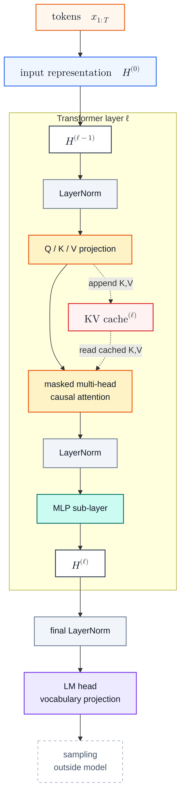

# GPT-3 Inference

GPT-3 Inference 是以 GPT-3 这种大规模 decoder-only Transformer 为例，说明自回归推理如何从 [[nanoGPT Inference]] 里的教学式 full forward，过渡到生产推理更常见的 prefill / decode 分离与 [[KV Cache]] 复用。GPT-3 论文公开的是模型架构和评估方式，而不是 OpenAI 的 serving 实现；本页讨论的是 GPT-3 架构自然导出的推理机制。[^gpt3]

## Mechanism

### Model Structure



这张图和 [[nanoGPT Inference#Model Structure]] 的主干相同：input representation 进入一叠 Transformer layer，最后经 LM head 得到词表 logits。区别在于 attention sub-layer 旁边显式画出了每层的 KV Cache：每层都会把新 token 的 $K,V$ 写入缓存，并在后续 decode step 读取历史 $K,V$。

> [!note]- Notation
> $L$ 表示 Transformer layer 数，$\ell$ 表示当前层，$T$ 表示当前上下文长度；$H^{(\ell)}$ 是第 $\ell$ 层输出的 residual stream，$h_t^{(\ell)}$ 是位置 $t$ 的 hidden state；$W_Q,W_K,W_V$ 是 attention 的线性投影矩阵，$d_k$ 是单个 head 的 key / value 维度。

> [!note]- GPT-3 Scale
> GPT-3 论文里的 175B 模型有 96 层、$d_{\text{model}}=12288$、96 个 attention head、每个 head 维度 128；所有模型使用 2048 token 的 context window。这个规模下，每生成一个 token 都重新 full forward 整个窗口，代价会非常高。[^gpt3]

### Prefill

Prefill 是处理 prompt 的阶段。给定 prompt tokens $x_{1:T}$，模型一次 forward 整个上下文，得到每一层、每个位置的 $K,V$：

$$
K_{1:T}^{(\ell)} = H^{(\ell-1)} W_K^{(\ell)}, \quad
V_{1:T}^{(\ell)} = H^{(\ell-1)} W_V^{(\ell)}
$$

然后写入第 $\ell$ 层的 cache：

$$
\mathcal{C}^{(\ell)}
=
\left(K_{1:T}^{(\ell)}, V_{1:T}^{(\ell)}\right)
$$

Prefill 的设计目标是一次性建立上下文状态。它仍然要处理整个 prompt，因此适合 GPU 并行计算；但它只做一次，而不是每生成一个 token 都重算一次。

### Decode With KV Cache

Decode 是逐 token 生成阶段。假设当前要生成第 $t$ 个 token，模型只输入最新 token 的 hidden state，并在每一层计算当前 token 的 $q_t,k_t,v_t$：

$$
q_t^{(\ell)} = h_t^{(\ell-1)} W_Q^{(\ell)}, \quad
k_t^{(\ell)} = h_t^{(\ell-1)} W_K^{(\ell)}, \quad
v_t^{(\ell)} = h_t^{(\ell-1)} W_V^{(\ell)}
$$

新的 $k_t,v_t$ 会追加到当前层 cache：

$$
\mathcal{C}^{(\ell)}
\leftarrow
\left(K_{1:t}^{(\ell)}, V_{1:t}^{(\ell)}\right)
$$

当前 token 的 attention 只需要当前 query 和缓存中的历史 K/V：

$$
y_t^{(\ell)}
=
\mathrm{softmax}
\left(
\frac{q_t^{(\ell)} (K_{1:t}^{(\ell)})^\top}{\sqrt{d_k}}
\right)
V_{1:t}^{(\ell)}
$$

这就是 KV Cache 的核心：历史 token 的 $K,V$ 不变，新增 token 不会改写历史 token 的输出，所以每步只计算新 token 这一行。更完整的数学证明见 [[KV Cache#数学推导]]。

> [!warning] Sparse Attention
> GPT-3 论文提到使用 alternating dense 和 locally banded sparse attention pattern。上面的公式按 dense causal attention 写，是为了说明 KV Cache 的基本机制；sparse attention 会改变某些层读取哪些历史位置，但不改变“缓存历史 $K,V$、新 token 只追加自己的 $K,V$”这个推理原则。[^gpt3]

### KV Cache Layout

不考虑 batch 时，第 $\ell$ 层的 KV Cache 可以直观写成：

$$
K^{(\ell)}, V^{(\ell)}
\in
\mathbb{R}^{h \times T \times d_k}
$$

其中 $h$ 是 attention head 数，$T$ 是已经缓存的 token 数，$d_k$ 是每个 head 的 key / value 维度。所有层合起来，KV Cache 的元素数量随上下文长度线性增长：

$$
\#\text{scalars}
\approx
2 \times L \times T \times h \times d_k
$$

这里的 $2$ 来自 Key 和 Value 两份缓存。若每个元素占 $s$ bytes，则显存近似为：

$$
\text{KV cache bytes}
\approx
2 \times L \times T \times h \times d_k \times s
$$

这个线性增长是生产推理中的核心显存压力：权重是固定成本，KV Cache 会随着 prompt 长度和已生成 token 数增长。

> [!example]- GPT-3 175B KV Cache 粗算
> 若按 dense KV Cache 和 fp16 粗算，$L=96$、$h=96$、$d_k=128$、$s=2$ bytes。单个 token 的 KV Cache 约为 $2 \times 96 \times 96 \times 128 \times 2 \approx 4.7$ MB；2048 token 的单序列 cache 约为 $9.7$ GB。这个量级解释了为什么 GPT-3-style 推理必须严肃处理 KV Cache 显存管理。

### Comparison With nanoGPT

| 维度 | [[nanoGPT Inference]] | GPT-3-style inference |
|---|---|---|
| 主要目的 | 教学实现，代码短 | 大模型推理，避免重复计算 |
| 每步输入 | 当前窗口内全部 token | decode 阶段只输入新 token |
| 历史 $K,V$ | 每步重算 | 存在 [[KV Cache]] 中复用 |
| 阶段划分 | 一个 `forward()` 循环 | prefill 建 cache，decode 追加 cache |
| 主要瓶颈 | 直观但重复计算多 | decode 读权重和读 KV Cache，常见 memory bound |

## Complexity

不考虑 batch，设 prompt 长度为 $T$，当前 decode 上下文长度为 $t$，生成 token 数为 $G$；模型有 $L$ 层，hidden size 为 $d=d_{\text{model}}$，attention head 数为 $h$，单 head 维度为 $d_k$，且 $d=h d_k$；MLP 中间维度记作 $d_{\text{ff}}$，词表大小记作 $|V|$。下面只保留主要项，embedding lookup、LayerNorm、activation、softmax 通常是较小项；空间复杂度重点看随请求长度增长的运行时状态，模型权重是固定显存成本。

### Prefill

Prefill 一次处理整个 prompt $x_{1:T}$，目标是生成每层的初始 KV Cache。对每一层，主要时间开销可以分成两类：

$$
\text{linear + MLP}
=O(Td^2 + T d d_{\text{ff}})
$$

$$
\text{dense causal attention}
=O(T^2 d)
$$

所以 $L$ 层 prefill 的主项可以写成：

$$
O\!\left(
L(Td^2 + T d d_{\text{ff}} + T^2 d)
\right)
$$

Prefill 的持久空间主要是写入 KV Cache：

$$
K^{(\ell)},V^{(\ell)}\in\mathbb{R}^{h\times T\times d_k}
$$

$$
\text{KV cache scalars}
=O(2LT h d_k)
=O(2LTd)
$$

临时空间取决于 attention kernel。朴素实现会显式形成 attention matrix，空间是 $O(hT^2)$；优化实现可以避免完整物化这个矩阵，但 KV Cache 的持久空间仍然按 $O(2LTd)$ 增长。

> [!note]- LM Head in Prefill
> 如果只需要生成下一个 token，serving 阶段通常只需要最后一个位置的 logits，LM head 是 $O(d|V|)$；如果对所有 prompt 位置都计算 logits，则是 $O(Td|V|)$。

### Decode

Decode 每一步只输入最新 token，但 attention 仍然要读历史 KV Cache。当前上下文长度为 $t$ 时，单层主项是：

$$
\text{linear + MLP}
=O(d^2 + d d_{\text{ff}})
$$

$$
\text{attention over cached KV}
=O(td)
$$

因此单个 decode step 的 $L$ 层主项为：

$$
O\!\left(
L(d^2 + d d_{\text{ff}} + td)
\right)
$$

如果从长度 $T$ 的 prompt 开始连续生成 $G$ 个 token，decode 总时间主项为：

$$
O\!\left(
LG(d^2 + d d_{\text{ff}})
+Ld(GT+G^2)
\right)
$$

Decode 的持久空间是在已有 cache 后继续追加：

$$
\text{KV cache scalars after }G\text{ tokens}
=O(2L(T+G)d)
$$

每多生成一个 token，会新增约 $2Ld$ 个 cache scalar。实际系统中，decode 经常不是单纯 FLOPs bound，而是 memory bound：每一步都要读模型权重、读历史 KV Cache、再写入新 token 的 $K,V$。

> [!warning] Dense Baseline
> 上面的 $O(T^2d)$ 和 $O(td)$ 按 dense causal attention 写。GPT-3 论文提到 alternating dense 与 locally banded sparse attention；sparse pattern 会改变 attention 项的有效历史长度，但不会改变 prefill 建 cache、decode 追加 cache 的阶段划分。

## Implementation

GPT-3-style 推理伪代码可以写成：

```python
# prefill
H = token_embedding(prompt_tokens) + position_embedding(positions)
kv_cache = []

for layer in transformer_layers:
    H, K, V = layer.prefill(H)
    kv_cache.append((K, V))

# decode
for _ in range(max_new_tokens):
    h = token_embedding([x_last]) + position_embedding([position])

    for layer_id, layer in enumerate(transformer_layers):
        h, k_new, v_new = layer.decode_one(h, kv_cache[layer_id])
        kv_cache[layer_id].append(k_new, v_new)

    h = final_layer_norm(h)
    z = lm_head(h)
    x_last = sample(softmax(z / temperature))
```

关键区别是：prefill 阶段把 prompt 的 $K,V$ 建好；decode 阶段每层只追加当前 token 的 $K,V$，然后用 cache 中的历史 $K,V$ 做 attention。

## Related

- [[nanoGPT Inference]] —— 无 KV Cache 的教学式推理流程
- [[KV Cache]] —— KV Cache 成立的数学基础
- [[LLM Inference Optimization]] —— prefill / decode 的瓶颈差异
- [[PagedAttention]] —— 生产服务中管理 KV Cache 显存碎片

[^gpt3]: Brown et al. (2020). [Language Models are Few-Shot Learners](https://arxiv.org/abs/2005.14165), especially §2.1 and Table 2.1.
