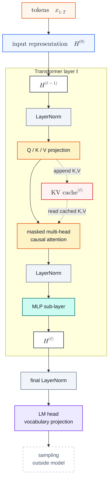

# GPT-3 Inference

GPT-3 Inference 是以 GPT-3 这种大规模 decoder-only Transformer 为例，说明自回归推理如何从 [[nanoGPT Inference]] 里的教学式 full forward，过渡到生产推理更常见的 prefill / decode 两阶段。[[KV Cache]] 在本页只作为 GPT-3 规模下必须引入的推理状态；数学证明和缓存内容放在 [[KV Cache]]。GPT-3 论文公开的是模型架构和评估方式，而不是 OpenAI 的 serving 实现；本页讨论的是 GPT-3 架构自然导出的推理机制。[^gpt3]

## Mechanism

### Model Structure

这张图和 [[nanoGPT Inference#Model Structure]] 的主干相同：input representation 进入一叠 Transformer layer，最后经 LM head 得到词表 logits。区别在于 attention sub-layer 旁边显式画出了每层的 KV Cache：每层都会把新 token 的 $K,V$ 写入缓存，并在后续 decode step 读取历史 $K,V$。

图中和后文反复出现的符号可以先按这个方式读：

| 符号 | 对应位置 | 含义 |
|---|---|---|
| $x_{1:T}$ | input tokens | 长度为 $T$ 的 token id 序列 |
| $H^{(0)}$ | input representation | token embedding 与 position embedding 相加后的初始 residual stream |
| $H^{(\ell)}$ | Transformer layer 输出 | 第 $\ell$ 层输出的 residual stream；$L$ 表示总层数 |
| $h_t^{(\ell)}$ | 单个位置 | 第 $\ell$ 层、位置 $t$ 的 hidden vector |
| $W_Q,W_K,W_V$ | Q / K / V projection | 把 hidden vector 投影成 query、key、value |
| $W_O$ | attention output projection | 把 attention 得到的向量投影回 residual stream；代码里常叫 `c_proj` 或 `out_proj` |
| $h,d_k$ | multi-head attention | $h$ 是 head 数，$d_k$ 是单个 head 的 key / value 维度 |

> [!note]- Pre-LN
> Pre-LN 是 pre-LayerNorm / pre-normalization 的简称，意思是 LayerNorm 放在每个 sub-layer 的输入侧。若 sub-layer 记作 $F$，post-LN 写作 $\mathrm{LN}(x+F(x))$，pre-LN 写作 $x+F(\mathrm{LN}(x))$。GPT-3 论文 §2.1 说明 GPT-3 沿用 GPT-2 架构里的 pre-normalization；GPT-2 论文 §2.3 更具体地说，LayerNorm 被移到每个 sub-block 的输入侧。[^gpt3][^gpt2]

> [!note]- GPT-3 Scale
> GPT-3 论文里的 175B 模型有 96 层、$d_{\text{model}}=12288$、96 个 attention head、每个 head 维度 128；所有模型使用 2048 token 的 context window。这里的重点不是说 GPT-3 serving 实际会朴素地重算整个窗口，而是说：如果没有 KV Cache 这类增量解码机制，每生成一个 token 都重新 full forward 整个窗口，代价会非常高。[^gpt3]

### GPT-2 vs GPT-3 Attention

GPT-3 不是只把 GPT-2 原样放大。GPT-3 论文 §2.1 说，模型主干沿用 GPT-2，但有一个明确例外：GPT-3 使用 alternating dense 和 locally banded sparse attention pattern，类似 Sparse Transformer。[^gpt3] 这个差异会影响某些层的 attention mask，但不是理解 Prefill、Decode 和 KV Cache 的必要前提。

| 维度 | GPT-2-style dense causal attention | GPT-3 attention pattern |
|---|---|---|
| 可见位置 | 每层都可见当前 token 及全部历史 token | dense 层可见完整前缀，sparse 层只可见部分前缀位置 |
| attention mask | $j\le i$ | 部分层使用局部稀疏 mask |
| 主要影响 | attention 项是 $O(T^2d)$ | sparse 层降低有效 attention 计算范围 |
| 不影响的部分 | 自回归方向、MLP、LayerNorm、LM head | 同左 |

后文为了让推理流程清楚，按 dense causal attention 写公式：位置 $i$ 可以读取 $\{1,\dots,i\}$。这不是声称 GPT-3 没有 sparse attention，而是把它从 Prefill / Decode / KV Cache 主线里拿掉。

### Prefill

Prefill 是处理 prompt 的阶段。给定 prompt tokens $x_{1:T}$，模型一次 forward 整个上下文，并在每一层把 prompt 对应的 $K,V$ 写入 KV Cache：

$$
\mathcal{C}^{(\ell)}
=
\left(K_{1:T}^{(\ell)}, V_{1:T}^{(\ell)}\right)
$$

Prefill 的设计目标是一次性建立上下文状态：它仍然完整处理 prompt，因此适合并行计算；但它只做一次，而不是每生成一个 token 都重算一次。为什么缓存的是 $K,V$ 而不是 $Q$，见 [[KV Cache#缓存什么]]。

### Decode With KV Cache

Decode 是逐 token 生成阶段。每一步只输入最新 token；在第 $\ell$ 层，模型计算当前 token 的 $q_t,k_t,v_t$，把新的 $k_t,v_t$ 追加到当前层 cache：

$$
\mathcal{C}^{(\ell)}
\leftarrow
\left(K_{1:t}^{(\ell)}, V_{1:t}^{(\ell)}\right)
$$

当前 token 的 attention 读取 cache 中已有的 $K,V$：

$$
y_t^{(\ell)}
=
\mathrm{softmax}
\left(
\frac{q_t^{(\ell)} (K_{1:t}^{(\ell)})^\top}{\sqrt{d_k}}
\right)
V_{1:t}^{(\ell)}
$$

KV Cache 优化的是 attention 里历史 token 的 $K,V$ 重算；当前 token 仍然要在每一层完整走过 LayerNorm、attention output projection、residual、MLP 等步骤。为什么历史 token 的输出不会被新 token 改写，见 [[KV Cache#数学推导]]。

## Complexity

这里详细计算 prefill / decode 的主项，但不重复 [[KV Cache#数学推导]] 里的正确性证明。为保持推理主线清楚，下面按 dense causal attention 近似计算；attention pattern 的架构差异只影响 attention 项，不改变 prefill / decode 的阶段划分。

### Symbols

不考虑 batch，设 prompt 长度为 $T$，当前 decode 上下文长度为 $t$，生成 token 数为 $G$；模型有 $L$ 层，hidden size 为 $d=d_{\text{model}}$，attention head 数为 $h$，单 head 维度为 $d_k$，且 $d=h d_k$；MLP 中间维度记作 $d_{\text{ff}}$，词表大小记作 $|\mathcal{V}|$。下面忽略 embedding lookup、LayerNorm、activation、softmax 等较小项；模型权重是固定显存成本，KV Cache 是随请求长度增长的运行时状态。

### Prefill Complexity

Prefill 一次处理整个 prompt $x_{1:T}$。单层主要计算项是：

$$
\text{QKV + output projection}
=O(Td^2)
$$

$$
\text{MLP}
=O(Td d_{\text{ff}})
$$

$$
\text{attention scores + value aggregation}
=O(T^2d)
$$

其中 attention 项来自 $QK^\top$ 和 attention weights 乘 $V$：每个 head 约是 $O(T^2d_k)$，$h$ 个 head 合起来是 $O(T^2 h d_k)=O(T^2d)$。

因此 $L$ 层 prefill 的主项是：

$$
O\!\left(
L(Td^2 + T d d_{\text{ff}} + T^2d)
\right)
$$

Prefill 结束后会形成初始 KV Cache：

$$
K^{(\ell)},V^{(\ell)}
\in
\mathbb{R}^{h\times T\times d_k}
$$

$$
\text{KV cache scalars}
=O(2LThd_k)
=O(2LTd)
$$

朴素 attention 若显式保存 attention matrix，临时空间是 $O(hT^2)$；优化 attention kernel 可以避免完整物化这个矩阵，但 KV Cache 的持久空间仍随 $T$ 线性增长。

> [!note]- LM Head in Prefill
> 如果 serving 只需要下一个 token 的 logits，通常只取最后一个位置过 LM head，开销是 $O(d|\mathcal{V}|)$；如果对所有 prompt 位置都算 logits，则是 $O(Td|\mathcal{V}|)$。

### Decode Complexity

Decode 每一步只输入最新 token。当前上下文长度为 $t$ 时，单层主要计算项是：

$$
\text{QKV + output projection}
=O(d^2)
$$

$$
\text{MLP}
=O(d d_{\text{ff}})
$$

$$
\text{attention over cached KV}
=O(td)
$$

所以单个 decode step 的 $L$ 层主项是：

$$
O\!\left(
L(d^2 + d d_{\text{ff}} + td)
\right)
$$

如果从长度 $T$ 的 prompt 开始连续生成 $G$ 个 token，decode 总时间主项可以写成：

$$
O\!\left(
LG(d^2+d d_{\text{ff}})
+Ld(GT+G^2)
\right)
$$

前半项是每个新 token 都要重新经过所有层的 projection 和 MLP；后半项来自 attention 逐步读取越来越长的 KV Cache。Decode 的持久空间是在已有 cache 后继续追加：

$$
\text{KV cache scalars after } G \text{ tokens}
=O(2L(T+G)d)
$$

这也是为什么 decode 常被说成 memory bound：每一步的 batch 内 token 数很小，但要反复读模型权重、读历史 KV Cache，并写入新的 $K,V$。更系统的瓶颈讨论见 [[LLM Inference Optimization]]。

## Related

- [[nanoGPT Inference]] —— 无 KV Cache 的教学式推理流程
- [[KV Cache]] —— KV Cache 成立的数学基础
- [[LLM Inference Optimization]] —— prefill / decode 的瓶颈差异
- [[PagedAttention]] —— 生产服务中管理 KV Cache 显存碎片

[^gpt3]: Brown et al. (2020). [Language Models are Few-Shot Learners](https://arxiv.org/abs/2005.14165), especially §2.1 and Table 2.1.
[^gpt2]: Radford et al. (2019). [Language Models are Unsupervised Multitask Learners](https://cdn.openai.com/better-language-models/language_models_are_unsupervised_multitask_learners.pdf), especially §2.3.
