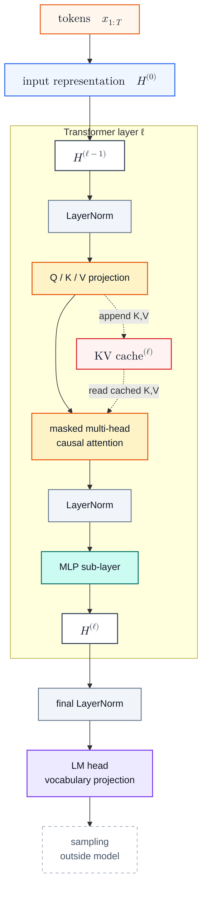

# GPT-3 Inference

GPT-3 Inference 不是一套全新的模型流程，而是把 [[nanoGPT Inference]] 里同类 decoder-only Transformer 放大到 GPT-3 175B 后，推理成本如何变化的问题。结构图仍然很像；差异主要来自规模、GPT-3 的 sparse attention pattern，以及大规模生成时必须显式管理的 [[KV Cache]]。GPT-3 论文公开的是模型架构和评估方式，而不是 OpenAI 的 serving 实现；本页只讨论由公开架构自然导出的推理视角。[^gpt3]

## Mechanism

### Model Structure

这张图刻意和 [[nanoGPT Inference#Model Structure]] 保持同一主干：input representation 进入多层 Transformer，最后经 LM head 得到词表 logits。GPT-3 推理真正多出来的重点，是 attention 旁边那份逐层增长的 KV Cache：新 token 写入自己的 $K,V$，后续 token 读取历史 $K,V$。

GPT-3 的架构差异也集中在 attention pattern。GPT-3 论文 §2.1 说，模型主干沿用 GPT-2，但 attention pattern 有一个明确例外：GPT-3 使用 alternating dense 和 locally banded sparse attention pattern，类似 Sparse Transformer。[^gpt3] 这会改变某些层能看见哪些历史位置；它不改变 LayerNorm、MLP、LM head 等模块的角色。

> [!note]- Pre-LN
> GPT-3 沿用 GPT-2 的 pre-normalization：LayerNorm 放在每个 sub-layer 的输入侧。若 sub-layer 记作 $F$，post-LN 写作 $\mathrm{LN}(x+F(x))$，pre-LN 写作 $x+F(\mathrm{LN}(x))$。[^gpt3][^gpt2]

复杂度部分按 dense causal attention 写公式：位置 $i$ 可以读取 $\{1,\dots,i\}$。这不是声称 GPT-3 没有 sparse attention，而是把 sparse pattern 从 prefill / decode 的常规阶段说明里拿掉。

## Scale

GPT-3 和 nanoGPT 的结构相似，但数量级不同。GPT-3 175B 的公开配置直接决定了推理成本的主项：[^gpt3]

| 维度 | GPT-3 175B | 推理含义 |
|---|---:|---|
| 参数量 | 175B | 权重本身就是主要显存和带宽压力 |
| Transformer layers $L$ | 96 | 每个 token 都要穿过 96 层 |
| hidden size $d_{\text{model}}$ | 12288 | projection 和 MLP 的矩阵乘法变重 |
| attention heads $h$ | 96 | 每层要维护多组 $K,V$ |
| head dimension $d_k$ | 128 | 单层 KV Cache 形状由 $h\times T\times d_k$ 决定 |
| context window | 2048 tokens | attention 与 KV Cache 都随上下文长度增长 |

所以这页的核心不是“GPT-3 比 nanoGPT 多了哪些模块”，而是“相同模块在 GPT-3 规模下会把哪些成本放大到必须优化”。

## Complexity

下面只计算 prefill / decode 的主项，不重复 [[KV Cache#数学推导]] 里的正确性证明。为保持公式可读，先按 dense causal attention 近似；GPT-3 的 sparse attention pattern 只会影响 attention 项的有效范围，不改变阶段划分。

### Symbols

不考虑 batch。设 prompt 长度为 $T$，当前 decode 上下文长度为 $t$，生成 token 数为 $G$；模型有 $L$ 层，hidden size 为 $d=d_{\text{model}}$，head 数为 $h$，单 head 维度为 $d_k$，且 $d=h d_k$。MLP 中间维度记作 $d_{\text{ff}}$，词表大小记作 $|\mathcal{V}|$。

下面忽略 embedding lookup、LayerNorm、activation、softmax 等较小项。模型权重是固定显存成本；KV Cache 是随请求长度增长的运行时状态。

### Prefill Complexity

Prefill 一次处理整个 prompt $x_{1:T}$，并为每层写入初始 KV Cache。单层主项是：

| 计算项 | 复杂度 | 来源 |
|---|---:|---|
| QKV + output projection | $O(Td^2)$ | 每个位置做线性投影 |
| MLP | $O(Td d_{\text{ff}})$ | 每个位置过两层 feed-forward |
| attention scores + value aggregation | $O(T^2d)$ | $QK^\top$ 和 attention weights 乘 $V$ |

attention 项的维度来源是：每个 head 约为 $O(T^2d_k)$，$h$ 个 head 合起来是 $O(T^2 h d_k)=O(T^2d)$。

因此 $L$ 层 prefill 的主项是：

$$
O\!\left(
L(Td^2 + T d d_{\text{ff}} + T^2d)
\right)
$$

Prefill 结束后会形成初始 KV Cache：

$$
K^{(\ell)},V^{(\ell)}
\in
\mathbb{R}^{h\times T\times d_k}
$$

$$
\text{KV cache scalars}
=O(2LThd_k)
=O(2LTd)
$$

如果朴素显式保存 attention matrix，单层临时空间是 $O(hT^2)$。优化 attention kernel 可以避免完整物化这个矩阵，但 KV Cache 的持久空间仍随 $T$ 线性增长。

> [!note]- LM Head in Prefill
> 如果 serving 只需要下一个 token 的 logits，通常只取最后一个位置过 LM head，开销是 $O(d|\mathcal{V}|)$；如果对所有 prompt 位置都算 logits，则是 $O(Td|\mathcal{V}|)$。

### Decode Complexity

Decode 每一步只输入最新 token。当前上下文长度为 $t$ 时，单层主项是：

| 计算项 | 复杂度 | 来源 |
|---|---:|---|
| QKV + output projection | $O(d^2)$ | 当前 token 的线性投影 |
| MLP | $O(d d_{\text{ff}})$ | 当前 token 的 feed-forward |
| attention over cached KV | $O(td)$ | 当前 query 读取长度为 $t$ 的历史 $K,V$ |

所以单个 decode step 的 $L$ 层主项是：

$$
O\!\left(
L(d^2 + d d_{\text{ff}} + td)
\right)
$$

从长度 $T$ 的 prompt 开始连续生成 $G$ 个 token，总时间主项是：

$$
O\!\left(
LG(d^2+d d_{\text{ff}})
+Ld(GT+G^2)
\right)
$$

前半项是每个新 token 都要经过所有层的 projection 和 MLP；后半项来自 attention 读取越来越长的 KV Cache。Decode 的持久空间是在已有 cache 后继续追加：

$$
\text{KV cache scalars after } G \text{ tokens}
=O(2L(T+G)d)
$$

这解释了为什么 decode 常被说成 memory bound：每一步只处理少量 token，却要反复读模型权重、读历史 KV Cache，并写入新的 $K,V$。更系统的瓶颈讨论见 [[LLM Inference Optimization]]。

## Related

- [[nanoGPT Inference]] —— 无 KV Cache 的教学式推理流程
- [[KV Cache]] —— KV Cache 成立的数学基础
- [[LLM Inference Optimization]] —— prefill / decode 的瓶颈差异
- [[PagedAttention]] —— 生产服务中管理 KV Cache 显存碎片

[^gpt3]: Brown et al. (2020). [Language Models are Few-Shot Learners](https://arxiv.org/abs/2005.14165), especially §2.1 and Table 2.1.
[^gpt2]: Radford et al. (2019). [Language Models are Unsupervised Multitask Learners](https://cdn.openai.com/better-language-models/language_models_are_unsupervised_multitask_learners.pdf), especially §2.3.
