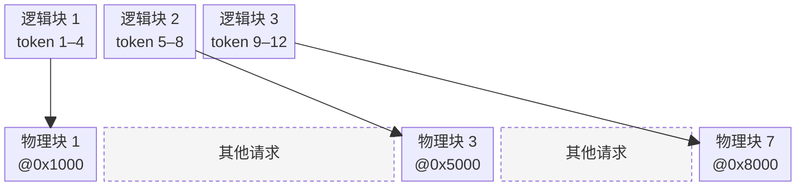

# PagedAttention

PagedAttention 是 vLLM 提出的 KV Cache 显存管理机制，把 KV Cache 从「每请求一段连续大块」改造成「固定大小的物理块 + 块表映射」，思路直接迁移自操作系统的虚拟内存与分页[^1][^2]。配合 online softmax 的分块 attention kernel，使 KV Cache 浪费率从 60–80% 降至 4% 以下，吞吐量提升 2–3 倍，已成为 vLLM、TensorRT-LLM、Hugging Face TGI 等主流推理引擎的标准做法。

## Background

### 朴素 KV Cache 的内存浪费

以 LLaMA-2-13B、FP16 为例，[[KV Cache]] 的规模如下：

| 规模 | 计算 | 结果 |
|---|---|---|
| 单 token 单层 | $2 \times 40 \times 128 \times 2$ | 20 KiB |
| 单 token 全部 40 层 | $20 \text{ KiB} \times 40$ | ≈ 0.78 MiB |
| 单个 4096 token 请求 | $0.78 \text{ MiB} \times 4096$ | ≈ 3.125 GiB |

在 A100 40 GB 上运行 LLaMA-2-13B 时，模型权重占 26 GB，剩余 14 GB 可供 KV Cache 使用；即使完全占用这部分显存，也仅能同时服务约 **7 个 2048-token 的请求**。

> [!tip] KV Cache 随 $B \times T$ 线性增长，是推理显存的主要瓶颈
> 模型权重固定不变，但 KV Cache 随并发请求数和上下文长度线性膨胀。显存能容纳的 KV Cache 总量直接决定推理吞吐量的上限——这正是 PagedAttention 要解决的核心问题。

vLLM 之前的主流做法是：**请求到达后即按 `max_tokens` 预分配一整段连续显存**。方案实现简单，但显存浪费严重，可分为两类。

**内部碎片（Internal Fragmentation）**：按最大可能长度一次性预留显存，但实际生成长度通常远小于此值。例如：

- 预留：$4096 \times 0.78 \text{ MiB} = 3.2 \text{ GiB}$
- 实际生成 100 token 后即触发 EOS：$\approx 78 \text{ MiB}$
- 浪费比例高达 **97.5%**；且该部分显存在请求结束之前始终被占用，其他请求无法复用。

**外部碎片（External Fragmentation）**：由于不同请求的预分配大小不一，它们完成并释放后会在显存中留下大小各异的空隙：

```
总空闲 = 32 + 16 + 64 = 112 GB
最大连续块 = 64 GB
→ 若有请求需要 64 GB 连续空间，则分配失败
```

综合来看，早期系统的 KV Cache 浪费率达 **60–80%**——理论上可服务 10 个请求的显存，实际仅能支撑 2–4 个。

> [!example]+ 餐厅类比：内存就是堂食座位
> 设想一家按桌预订的餐厅，每桌一律按"最多 10 人"预留座位：
> - 若某桌实际只到 2 人，其余 8 个座位仍被该桌占用 → 内部碎片
> - 若干桌先后离开，留下大小各异的空位，此时来一个 10 人团，却无法在任何单桌凑足 10 个连续座位 → 外部碎片
>
> PagedAttention 的思路：将餐厅改为**统一的 4 人桌**，需要容纳更大团体时由多桌拼接。既避免单桌的过度预留，也避免碎片无法利用。

### 操作系统的虚拟内存与分页

操作系统面临的内存管理问题与 KV Cache 在结构上完全相同：

- 物理内存容量有限且地址离散；
- 每个进程都期望看到一段完整连续的地址空间；
- 各进程的大小与生命周期不同，若强行连续分配将导致严重碎片。

OS 的经典解决方案是**分页 + 虚拟内存**：

| 组件 | 作用 |
|---|---|
| **物理帧**（physical frame） | 将物理内存划分为固定大小的单元（典型值 4 KB） |
| **虚拟页**（virtual page） | 将进程地址空间按同样大小划分 |
| **页表**（page table） | 维护映射关系：虚拟页号 → 物理帧号 |
| **MMU** | 在每次访存时按页表完成虚拟到物理的地址翻译 |

该机制带来三项关键优势：

1. **物理内存不必连续**——任意虚拟页可映射到任意物理帧，外部碎片消失。
2. **按需分配**——虚拟地址空间可大于物理内存，仅在实际访问时分配帧。
3. **便于共享**——多个进程的虚拟页可映射到同一个物理帧（例如共享库、fork 后的 COW 机制）。

## Mechanism

### 类比映射：从 OS 分页到 KV Cache

vLLM 作者的关键洞察是：**将上述机制直接迁移到 KV Cache 管理中**。

| OS 分页 | PagedAttention |
|---|---|
| 物理帧（4 KB） | **物理块**（每块存储 $B$ 个 token 的 K/V，典型 $B=16$） |
| 虚拟页 | **逻辑块**（请求视角下的第 0, 1, 2… 块） |
| 页表 | **块表**（block table：逻辑块号 → 物理块 ID） |
| 进程地址空间 | 单个请求的 KV Cache |
| 共享内存 / COW | 前缀共享（后续章节详述） |

> [!note] KV Cache 不必在显存中连续，块表承担了映射职责
> 核心改变在于：KV Cache 不再要求连续存放，只需块表记录每个逻辑块对应的物理块位置。由此，前述两类碎片在机制层面即被消除——物理块大小固定，任何空闲块都可被任意请求使用。

> [!question]- 为什么不直接使用操作系统自带的内存管理？
> 1. **管理对象不同**：OS 的分页机制作用于 CPU 主存（DRAM），而 GPU 显存（HBM）由 CUDA 运行时交给应用自行管理，OS 基本不介入。
> 2. **硬件级 GPU 分页代价过高**：CUDA Unified Virtual Memory（UVM）确实提供类似机制，但其 page fault 触发 CPU↔GPU 数据迁移，延迟在数百微秒量级，远超 decode 单 token 的耗时；且页迁移会破坏 warp 级的 coalesced memory access。在 attention 这种 hot path 上不可接受。
> 3. **语义粒度不匹配**：OS 页是 4 KB 字节流，不感知 "token" 或 "K/V"。PagedAttention 的块按"$B$ 个 token 的 K/V"设计，attention kernel 天然按 token 遍历，块大小也可针对硬件（L2 cache、warp 大小）调优。
> 4. **应用层语义缺失**：前缀共享、beam search 的 COW、按请求优先级驱逐、基于剩余块数拒绝入队等 LLM 服务特有的调度行为，OS 无法感知，更谈不上针对性优化。
>
> 这是系统软件的一般规律：数据库自管 buffer pool、JVM 自管堆内存、PagedAttention 自管 KV Cache——**应用比 OS 更了解自己的访存模式与语义**。PagedAttention 是将 OS 分页的**思想**迁移到"用户态 + GPU 显存 + LLM 语义"这一新场景下的重新设计，并非直接复用 OS 机制。

### 块表与物理块池

PagedAttention 在显存中维护三类对象：

1. **物理块池（Physical Block Pool）**：显存预先划分为大量固定大小的物理块，每块容纳 $B$ 个 token 的 K/V（vLLM 默认 $B=16$）。用一个全局空闲链表跟踪哪些块未被占用。
2. **每请求的块表（Block Table）**：每个请求独自维护一张表，将本请求的逻辑块号映射到物理块 ID。逻辑块号表示在请求内部的顺序，物理块 ID 表示显存中的实际位置。
3. **每块的填充状态**：记录每个物理块当前已写入的 token 数；当前块未满时继续写入同一块，写满后才从空闲池申请新块。

**Prefill 阶段的分配**：设 prompt 长度为 $N$、块大小为 $B$，则需要 $\lceil N/B \rceil$ 个物理块。从空闲块池取相应数量的物理块，将 ID 依次写入请求的块表，执行 prefill attention 并按块表将 K/V 写入对应物理块。

例如 $N=7, B=4$，需要 $\lceil 7/4 \rceil = 2$ 个块。假设分配到物理块 1、3：

```
块表: [1, 3]
物理块 1: [tok0, tok1, tok2, tok3]   ← 已满
物理块 3: [tok4, tok5, tok6, _   ]   ← 已用 3/4
```

**Decode 阶段的分配**：每生成一个 token，若当前最后一个逻辑块尚未写满，则写入下一个空槽位；若已写满，则从空闲池取一个新块挂接到块表末尾。

接上例继续生成：

- 第 1 个新 token：写入块 3 的第 4 个槽位，块 3 变为已满。
- 第 2 个新 token：块 3 已满，从空闲池取一个新块（假设 ID=7），将 token 写入其第 1 槽位；块表更新为 `[1, 3, 7]`。

请求结束后，该请求持有的所有物理块归还至空闲池。

> [!success] 单请求最多浪费 $B-1$ 个 token 的空间，与 prompt 长度和生成长度无关
> 由于每块大小固定为 $B$，单个请求仅在最后一个逻辑块中可能出现未填满的槽位，最坏情况浪费 $B-1$ 个 token 的空间。这一性质与 prompt 长度、生成长度、并发请求数均无关——这正是 PagedAttention 将 KV Cache 浪费率从 60–80% 降至 <4% 的根本原因。

### Online softmax：分块如何不漏算 attention

在 [[Transformer]] 中，scaled dot-product attention 定义为：

$$
\text{Attention}(Q, K, V) = \text{softmax}\left(\frac{QK^\top}{\sqrt{d}}\right) V
$$

对单个查询 token $i$，计算流程可拆为三步：

1. 用 $q_i$ 与所有历史 token 的 key 做点积，得到相关度分数向量 $s = (s_1, s_2, \ldots, s_N)$；
2. 对 $s$ 做 **softmax**，得到加起来等于 1 的权重向量；
3. 用这组权重对 value 向量加权求和，得到输出。

**Softmax 是什么**。softmax 的作用是将任意大小的一组数转成加起来为 1 的权重：

$$
\text{softmax}(s)_t = \frac{e^{s_t}}{\sum_u e^{s_u}}
$$

选择 $e^x$ 而非直接按比例归一化的原因：

- **保证正值**：原始分数可能为负，直接求和会相互抵消；$e^x$ 恒为正。
- **放大差距**：分数差 1 会导致权重相差约 $e \approx 2.7$ 倍，这种"赢家通吃"正是 attention 所需要的——让权重集中在最相关的少数 token 上。

以 $s = [1, 3, 2]$ 为例：

- $e^1 \approx 2.72$、$e^3 \approx 20.09$、$e^2 \approx 7.39$，总和约 $30.2$；
- 归一化后权重约 $[0.09, 0.66, 0.25]$，和为 1。

**数值稳定：先减最大值再取指数**。$e^x$ 增长极快，$x=100$ 时结果已超出浮点数可表示范围。所有主流 softmax 实现都先减最大值再取指数：

$$
\text{softmax}(s)_t = \frac{e^{s_t - m}}{\sum_u e^{s_u - m}}, \quad m = \max_u s_u
$$

分子分母各多一个 $e^{-m}$ 因子，相互约去——数学上等价，但现在 $e^{s_t - m} \le 1$，永不溢出。代价是必须先扫完所有分数才能拿到最大值 $m$。

**PagedAttention 下的新问题**。标准做法"先扫一遍找 $m$、再扫一遍算 softmax"在 PagedAttention 下代价翻倍：

- K/V 分散在多个物理块中，每加载一块都要付显存带宽代价；
- 两遍扫描意味着每块读两次，带宽消耗翻倍；
- Decode 本就是 memory-bound（见 [[LLM Inference Optimization#ops:byte 比值与 Memory Bound]]），这种代价不可接受。

需要一种**只扫一遍**就能得到正确 softmax 的方法。

**Online softmax 的想法**。核心思路：**边遍历边累加，遇到更大的最大值就对之前的累积做一次修正**。遍历过程中维护三项运行状态：

- $m$：到目前为止见过的最大分数；
- $\ell$：以当前 $m$ 为基准的 $\sum e^{s_t - m}$；
- $o$：以当前 $m$ 为基准的 $\sum e^{s_t - m} v_t$（softmax 加权输出的累积）。

每加载新块 $j$ 时执行三步：

1. **求本块最大值并更新全局最大值**：$m_j' = \max_t \text{scores}_{j,t}$，$m_\text{new} = \max(m_\text{old}, m_j')$；
2. **对已累积的 $\ell$ 与 $o$ 做基准修正**：$\ell \leftarrow \ell \cdot e^{m_\text{old} - m_\text{new}}$，$o$ 同理；
3. **加入本块在新基准下的贡献**：$\ell \leftarrow \ell + \sum_t e^{s_{j,t} - m_\text{new}}$，$o$ 同理。

遍历完所有块后，最终 attention 输出为：$\text{attn}_i = o / \ell$。

**修正因子从何而来**。一行推导说明为何"乘 $e^{m_\text{old} - m_\text{new}}$"即可把旧累积换到新基准：

$$
\sum_t e^{s_t - m_\text{new}} = \sum_t e^{s_t - m_\text{old}} \cdot e^{m_\text{old} - m_\text{new}}
$$

因子 $e^{m_\text{old} - m_\text{new}}$ 与求和变量 $t$ 无关，可提到求和外——这正是修正因子的由来。

**数值示例：两块分数的合成**。设某查询 token 的 5 个分数分在两块：

- 块 1：$s = [1, 3, 2]$
- 块 2：$s = [5, 4]$

初始：$m = -\infty$、$\ell = 0$。

加载块 1：

- 本块最大 $m_1' = 3$，更新 $m = 3$；
- 加入本块贡献：$\ell = e^{1-3} + e^{3-3} + e^{2-3} \approx 0.135 + 1.0 + 0.368 = 1.503$。

加载块 2：

- 发现 $5 > 3$，更新 $m = 5$；
- 修正旧 $\ell$：$1.503 \cdot e^{3-5} \approx 1.503 \cdot 0.135 = 0.203$；
- 加入本块贡献：$\ell = 0.203 + e^{5-5} + e^{4-5} \approx 0.203 + 1.0 + 0.368 = 1.571$。

一次性直接计算对照：

$$
\ell_\text{direct} = e^{1-5} + e^{3-5} + e^{2-5} + e^{5-5} + e^{4-5} \approx 0.018 + 0.135 + 0.050 + 1.0 + 0.368 = 1.571 \;\checkmark
$$

两者完全一致，验证 online softmax 与标准 softmax 等价。$o$ 按同样方式维护，此处从略。

**分块遍历 + Online Softmax = PagedAttention Kernel**。标准 attention 把 $qK^\top$ 当作一次大 GEMM；PagedAttention 因为 K/V 分散，必须拆成逐块处理，每块结束后用 online softmax 合并：

```
for j = 1 to ⌈N/B⌉:
    physical_id = block_table[j]             # 查块表拿到物理块 ID
    K_j, V_j = load_block(physical_id)       # 加载本块 K/V
    scores_j = (q_i · K_j^T) / √d            # 本块分数
    根据 scores_j 更新 (m, ℓ, o)，必要时做基准修正
最终输出: o / ℓ
```

逻辑顺序与物理分布的对照——上行：请求视角下连续的三个逻辑块；下行：GPU 显存中按实际地址比例排布，块大小 $=$ 0x1000，物理块 1 与 3 之间隔 0x3000（被其他请求占用 3 个块），物理块 3 与 7 之间隔 0x2000（被占用 2 个块）：



逻辑块连续、物理块分散；箭头表示块表映射，同宽保证每个逻辑块与其对应物理块在大小上一致。

每个物理块**只加载一次**，访存压力与连续存放几乎持平。这一点对 GPU 也足够友好：块内连续张量满足 coalesced 访存；跨块跳跃每 $B$ 个 token 才发生一次；块表只有几十到几百项，可常驻 GPU 寄存器 / shared memory。

> [!note] PagedAttention 与 online softmax 是一对配套设计
> - **PagedAttention** 解耦 KV Cache 的空间管理，换来碎片率从 60–80% 降至 <4%；
> - **Online softmax**（最早由 FlashAttention 引入）让计算开销不被"分块存储"拖累，保证每块单次加载即可完成 attention。
>
> 一个解决"存哪里"，一个解决"怎么算"。vLLM 的 attention kernel 底层正是基于 FlashAttention 实现——二者共享"分块 + online softmax"的底层设计范式。

### Copy-on-Write 与前缀共享

真实推理服务中，大量 KV Cache 的开头部分是相同的。来源分为两类：

**请求间共享**（跨不同请求的相同前缀，生产服务的主力收益）：

- **相同 system prompt**：所有用户共用的系统提示（几百 token）；
- **相同 few-shot 示例**：批量任务中重复的 exemplar；
- **多轮对话**：下一轮把前几轮历史再发一次。

**请求内共享**（单个请求内部多条生成路径共用 prompt）：

- **Parallel sampling / beam search**：一请求多个候选输出，分歧前完全一致。

两类场景若独立存储前缀的 KV Cache 都会造成严重重复。前缀共享（prefix sharing）的目标是让所有这些场景**读取同一份物理存储**。

借鉴 OS 中 `fork()` 的 COW（写时复制），Block Manager 用两条规则处理所有共享场景——**不区分共享来源**：

**共享阶段**：

- 多个块表条目指向**同一个物理块 ID**；
- 每个物理块维护一个 `ref_count`（引用计数）；
- 当 `ref_count > 1` 时，该块为**只读共享**，任何方不得直接写入。

**写时复制**：持有 `ref_count > 1` 的共享块的一方需要写入新 token 时：

1. 从空闲池申请一个新物理块；
2. 将原共享块的内容复制到新块；
3. 该方的块表条目重定向至新块；
4. 原共享块 `ref_count -= 1`。

> [!note]+ COW 是通用机制，不区分共享来源
> Block Manager 的 COW 代码路径**只关心 `ref_count > 1`**——不关心共享是因为 parallel sampling 的兄弟分支、还是 prefix cache 命中了另一个请求的 block。请求内共享与请求间共享走的是**完全相同**的一段代码。
>
> COW 在系统软件里是个一般性原则：OS 的 `fork()`、数据库的 MVCC、Git 对象存储、ZFS 文件快照全都基于同样的"延迟复制，直到必须修改时才承担成本"思想。vLLM 的 Block Manager 只是把它应用在了 KV Cache 管理上。

实际收益分布如下：

| 共享来源 | 典型场景 | 在生产 chat 服务中的占比 |
|---|---|---|
| **请求间共享** | system prompt、多轮对话历史、few-shot 模板 | **主力**（cache hit rate 常达 50–90%） |
| **请求内共享** | parallel sampling（`n>1`）、beam search | 少数（多数 API 调用 `n=1`；beam search 在现代 LLM 中已罕用） |

## Variants & Comparisons

### 与 RadixAttention 的关系

[[SGLang]] 的 **RadixAttention** 专门加强请求间共享——把 prefix cache 做成 radix tree，支持跨请求匹配任意长度、任意位置的公共前缀（不限于 block 边界对齐），进一步拉高 cache hit rate。这是 SGLang 相对 vLLM 在多轮对话 / Agent 场景的关键优势。

PagedAttention 与 RadixAttention 并非互斥：PagedAttention 解决"显存以什么粒度切分"，RadixAttention 解决"前缀以什么数据结构索引"。SGLang 在底层同样使用块化 KV Cache，只是把 vLLM 哈希表式的前缀缓存换成了 radix tree 索引。

## Trade-offs

### 定量收益

| 指标 | 朴素预分配方案 | PagedAttention |
|---|---|---|
| KV Cache 浪费率 | 60–80% | $<4\%$ |
| 可服务并发请求数 | 基准 | 2–4 倍 |
| 推理吞吐量 | 基准 | 2–3 倍 |

### 业界采用

PagedAttention 思想已成为主流推理引擎的标配：

- **vLLM**：原生实现；
- **TensorRT-LLM**：引入类似机制；
- **Hugging Face TGI**：支持 paged KV cache。

更重要的是，它确立了 **"推理服务 = 操作系统式显存管理 + 动态调度"** 的工程范式，为 [[LLM Inference Optimization#PD 分离与 Continuous Batching|continuous batching]]、prefix caching、KV Cache 分层等后续实践奠定基础。

## Related

- [[KV Cache]] —— PagedAttention 优化的 KV Cache 是这里来的
- [[vLLM]] —— 第一个采用 PagedAttention 的推理引擎，配合 Block Manager 实现
- [[SGLang]] —— 同领域的另一种思路（RadixAttention + RadixCache）
- [[LLM Inference Optimization#PD 分离与 Continuous Batching]] —— 上层的调度优化与 PagedAttention 配合

[^1]: [[Sources/Clippings/Paged Attention from First Principles A View Inside vLLM]]
[^2]: Kwon et al. (2023). [Efficient Memory Management for Large Language Model Serving with PagedAttention](https://arxiv.org/abs/2309.06180)
