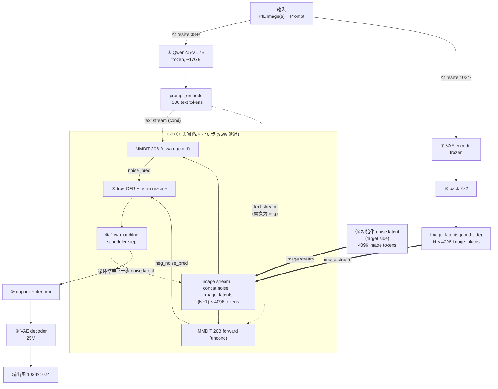
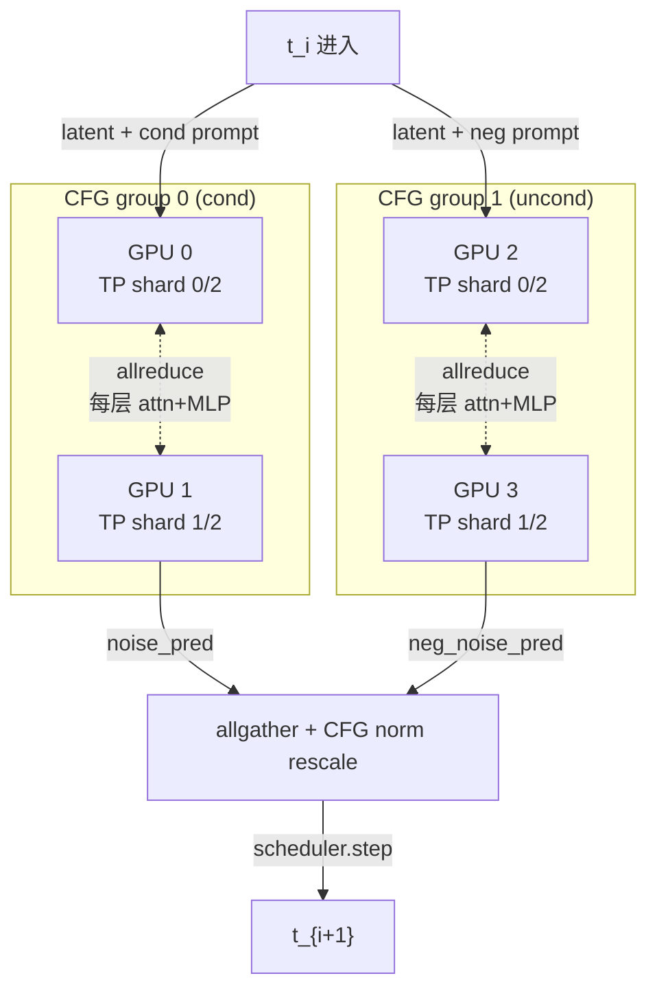

# Qwen-Image-Edit-2511

Qwen-Image-Edit-2511 是阿里 Qwen Team 于 2025-11 发布的图像编辑模型，属 Qwen-Image-Edit 独立线最后一个明确公开的版本（2026-02 后 gen+edit 合并进 [[Qwen-Image-2.0]]）。**架构层面与上一代 Qwen-Image-Edit-2509 完全相同**——同样的 20B [[DiT|MMDiT]] 主干 + 冻结 Qwen2.5-VL + Wan-2.1-VAE 双路 conditioning（详见 [[DiT]]）。所有改进都在 MMDiT 权重里，pipeline 执行路径分毫未动[^1]。

## Background

2511 与前代官方列出的 5 项 delta（verbatim）[^1]：

1. **Mitigate image drift** —— 多轮迭代编辑后画面"漂移"被缓解（具体技术手段官方未披露）
2. **Improved character consistency** —— 想象性编辑下保留人物 identity，多人合影融合提升
3. **Integrated LoRA capabilities** —— 把社区流行 LoRA 内置进 base model；已确认能力包括 Lighting Enhancement、Viewpoint generation；集成方式官方未披露
4. **Enhanced industrial design generation** —— 工业设计场景渲染质量提升
5. **Strengthened geometric reasoning** —— 直接生成辅助构造线、技术蓝图

> [!warning] 没有 benchmark 数字
> 官方 blog 和 HF 模型卡都未提供与 2509 / 其他模型的定量对比，只有定性 showcase。评测只能靠 community arena（如 [Artificial Analysis](https://artificialanalysis.ai/)）。

## 执行流水线

下面流程是从 diffusers `QwenImageEditPlusPipeline` 源码核实的[^2]，2509 和 2511 共用同一个 pipeline class——区别只在加载的 MMDiT 权重。

### 整体流程



**三条数据流的视觉约定**：粗线 `==>` 是 image stream（VAE 像素 latent），虚线 `-.->` 是 text stream（Qwen2.5-VL 语义 embedding），细线 `-->` 是控制流。MMDiT 双流 attention 在每一步把 image stream 和 text stream 拼成一条 self-attn 序列互相看（详见 [[DiT]]）。

### ① 输入分辨率分流

同一张输入图被 resize 成两个分辨率，喂两个 encoder：

- **Condition path**：384×384，喂 Qwen2.5-VL（只需"看懂"图里有什么）
- **VAE path**：输出分辨率（默认 1024×1024），喂 VAE encoder（要保留像素级细节）

源码常量：`CONDITION_IMAGE_SIZE = 384*384`、`VAE_IMAGE_SIZE = 1024*1024`。

### ② Qwen2.5-VL forward（一次性，frozen）

模型 ~7B、bf16、~17 GB VRAM 驻留。输入 prompt 模板带 vision token 占位符：

```
<|im_start|>system
Describe the key features of the input image (color, shape, size, texture,
objects, background), then explain how the user's text instruction should
alter or modify the image. Generate a new image that meets the user's
requirements while maintaining consistency with the original input where
appropriate.<|im_end|>
<|im_start|>user
Picture 1: <|vision_start|><|image_pad|><|vision_end|>
Picture 2: <|vision_start|><|image_pad|><|vision_end|>
{user_prompt}<|im_end|>
<|im_start|>assistant
```

输出 last hidden state `(batch, seq_len, 4096)`，砍掉前 64 个 token（system prompt 固定头部）得到最终 `prompt_embeds`，喂 MMDiT 的 text stream。

### ③ VAE encoder forward（一次性 per input image）

Wan-2.1-VAE，frozen，8×8 下采样：

```python
image_latents = retrieve_latents(vae.encode(image), sample_mode="argmax")
image_latents = (image_latents - latents_mean) / latents_std
```

1024×1024 输入 → 128×128×16 latent。用 `argmax` 取确定性 latent（不采样）。

### ④ Latent packing（2×2 patch 重排）

VAE latent reshape 成 sequence 形式喂 transformer：

```python
# (B, 16, 128, 128) → (B, 64*64, 16*4) = (B, 4096, 64)
latents.view(B, C, H//2, 2, W//2, 2).permute(0,2,4,1,3,5).reshape(B, (H//2)*(W//2), C*4)
```

**每张 1024×1024 图 → 4096 个 image tokens，每个 64 维。**

多图沿 sequence 维拼接：N 张输入图 → N × 4096 image tokens 串成一条。

### ⑤ 初始化噪声 latent

按目标输出 shape `(batch, 4096, 64)` 采高斯噪声，作为 flow matching 的起点 $x_1$。

### ⑥ MMDiT denoising loop（40 步，**主成本**）

每一步的输入构造：

```python
latent_model_input = torch.cat([latents,        # 噪声 latent（target side, 4096 tokens）
                                image_latents], # 输入图 latent（condition side, N×4096）
                                dim=1)
```

→ 噪声 latent 和 reference 一起串成 image stream，让 MMDiT 双流 attention 中两边互相看见。这就是 dual conditioning 的具体实现。

MMDiT forward 后切片，只保留 noise side 输出：

```python
noise_pred = transformer(
    hidden_states=latent_model_input,         # image stream，(N+1)×4096 tokens
    encoder_hidden_states=prompt_embeds,      # text stream，~500 tokens
    image_rotary_emb=image_rotary_emb,        # MSRoPE，每步动态重算
    timestep=t/1000,
)[0]
noise_pred = noise_pred[:, :latents.size(1)]  # 抛弃 input image side 的预测
```

> [!note] MSRoPE 每步动态重算
> `image_rotary_emb` 基于真实 `img_shapes` + `txt_seq_lens` 重新计算 → 支持任意分辨率、任意张数输入图，无需固定 shape 训练。

### ⑦ True CFG with norm rescaling（**Qwen 特有**）

CFG (Classifier-Free Guidance) 是 diffusion 通用技巧：跑一次 cond + 一次 uncond，按权重组合让生成更贴合 prompt。Qwen 在此基础上加一步 norm 重标定：

```python
# 1) 再跑一次 MMDiT，用 negative prompt embeds
neg_noise_pred = transformer(..., encoder_hidden_states=negative_prompt_embeds)

# 2) 经典 CFG 组合
comb_pred = neg_noise_pred + true_cfg_scale * (noise_pred - neg_noise_pred)

# 3) Norm 重标定——防止 CFG 把幅度放大
cond_norm  = torch.norm(noise_pred, dim=-1, keepdim=True)
noise_norm = torch.norm(comb_pred, dim=-1, keepdim=True)
noise_pred = comb_pred * (cond_norm / noise_norm)
```

> [!warning] CFG 让每步 MMDiT forward 翻倍
> `true_cfg_scale=4.0` 默认开启 → 40 步 → 实际 **80 次 20B forward**。这是延迟主因。

> [!tip] 第 3 步 norm rescaling 是 Qwen 设计选择
> SD3 / FLUX 都不做。目的是阻止 CFG 把 noise prediction 的 magnitude 拉爆（爆了就会有过曝、色块）。

### ⑧ Scheduler step + 循环

Flow matching scheduler 用 noise_pred 更新 latent，回到 ⑥，循环 40 步：

```python
latents = scheduler.step(noise_pred, t, latents)[0]
```

### ⑨ Unpack + 反归一化

```python
latents = _unpack_latents(latents, height, width, vae_scale_factor)  # (B, 4096, 64) → (B, 16, 1, 128, 128)
latents = latents / latents_std + latents_mean
```

### ⑩ VAE decoder forward（一次性）

VAE decoder（25M 参数，paper §2.3 fine-tune 过）解码为 RGB：

```python
image = vae.decode(latents)[0][:, :, 0]   # → (B, 3, 1024, 1024)
```

## 推理成本 breakdown

单图编辑、1024×1024 输出、40 步、true CFG 开：

| 阶段 | 调用次数 | 模型规模 | 占总延迟比 |
|---|---|---|---|
| ② Qwen2.5-VL encode | 1 | 7B (~17 GB bf16) | ~3% |
| ③ VAE encode | 1 × N input images | 19M (encoder) | <1% |
| ⑥+⑦ MMDiT loop | **80**（40 步 × 2，因 CFG）| 20B | **~95%** |
| ⑩ VAE decode | 1 | 25M (decoder) | ~1% |

> [!example] 主成本几乎全在 MMDiT
> 这就是为什么社区主要优化方向是 step distillation（如 `lightx2v/Qwen-Image-Edit-2511-Lightning` 8 步版 → 16 次 forward、~5× 加速）和 quantization（FP8 / GGUF / 8bit）。

## 多图编辑的成本特征

输入 K 张图时（K=1,2,3 是官方推荐范围）：

- VAE encode 调用 K 次（线性）
- MMDiT image stream tokens = (K+1) × 4096
- MMDiT attention 算力 ≈ O((K+1)² × 4096²)

具体：

| K（输入图数）| MMDiT 单步 attention 相对成本 |
|---|---|
| 1 | 1× (baseline) |
| 2 | ~2.25× |
| 3 | ~4× |

> [!note] 这就是 "optimal 1–3 input images" 的算力侧解释
> 不是模型上限，是 attention O(n²) 让 4 张图以上成本急剧上升。

## 服务化部署：vllm-omni 三层并行

上面的 pipeline 描述对应 diffusers 单卡参考实现。生产服务化常用 [[vLLM]] 项目下的 **vllm-omni** 子项目——它对 Qwen-Image-Edit-2511 做了**算法层完全等价但硬件层三层并行**的重写：同样 dual conditioning、flow matching、norm-rescaled CFG，但把"算同一个东西"映射到了 TP / CFG / SP 三个独立可配置的并行维度上[^4]。

### 三层并行维度

| 并行类型 | 切分对象 | 每步通信原语 | 配置项 |
|---|---|---|---|
| **TP** (Tensor Parallel) | MMDiT 每层 weight 矩阵沿列/行切 | 每个 attn / MLP block 末尾 1 次 **allreduce**（Megatron 风格）| `tp_size` |
| **CFG Parallel** | cond / uncond 两次 forward 分到不同 GPU | 每步 scheduler 前 1 次 **allgather** noise_pred | `cfg_parallel_size` |
| **SP** (Sequence Parallel) | image stream 沿 sequence 维切 | 每层 attention 入口 1 次 **all-to-all** | `sp_size` |

三者**可乘叠**。典型 8 GPU 部署：TP=4 × CFG=2，或 TP=2 × CFG=2 × SP=2。

> [!tip] CFG Parallel 是几乎免费的 2× 加速
> diffusers 单卡时 cond / uncond 是**串行 2 次 forward**（40 步 → 80 次 MMDiT 调用）。vllm-omni 让两次 forward 在不同 GPU group 上**并行跑**，wall-clock 减半，只多一次 allgather（量极轻，~MB 级）。

### 4 GPU 部署示例（TP=2, CFG=2）



每步通信量粗算：

- **TP allreduce**：60 层 × 2 次/层 ≈ 120 次 allreduce / step / GPU。单次量 ≈ `(N+1)×4096 × 18432 × 2 byte / tp_size`。**延迟主体里的延迟主体**。
- **CFG allgather**：1 次 / step，量 ≈ `(N+1)×4096 × 64 × 2 byte`。**极轻**。
- **SP all-to-all**（若开）：每层 attention 入口 1 次，量级随 `seq_len / sp_size` 缩。

→ TP 是延迟瓶颈、CFG 是免费加速、SP 适合超大序列（K=3 多图 + 2K 输出场景）。

### Fused / 替换的算子（数值计算层）

vllm-omni 把 diffusers 原版若干 layer 换成 vLLM 优化版本[^5]：

| 原 diffusers | 替换为 | 收益 |
|---|---|---|
| `nn.Linear`（独立 Q/K/V）| `QKVParallelLinear`（fused）| 一次 GEMM 出三份 |
| `nn.RMSNorm` | `vllm.layers.layernorm.RMSNorm` | fused kernel |
| `AdaLayerNorm` | `vllm_omni.layers.adalayernorm.AdaLayerNorm` | fused（带 `modulate_index` 支持，见下节）|
| `RotaryEmbedding` | `vllm_omni.layers.rope.RotaryEmbedding` | fused，避免 sin/cos 重算 |
| `F.scaled_dot_product_attention` | `vllm_omni.attention.Attention`（FlashAttn 后端）| 真正的 FlashAttn-2 / 3 kernel |

> [!warning] 精度敏感处保留 bf16
> `QwenTimestepProjEmbeddings.timestep_embedder` 源码注释明确写 `quant_config=None`——即使整体开 FP8 / int8 量化，这层 timestep MLP 仍是 bf16，因为它喂的是 per-block AdaLayerNorm 调制参数，量化误差会逐层放大。

### CPU / GPU 工作分工

vllm-omni 把 `pre_process_func` / `post_process_func` 显式抽出来，让 DiffusionEngine 在 CPU worker 上做 image resize / VAE preprocess，**GPU 只跑 encode / denoise / decode**：

```
CPU worker                            GPU worker
  ─ PIL Image.open()
  ─ resize 384²       ─┐
  ─ preprocess 1024²  ─┘─────────────▶ text_encoder forward
                                       VAE encoder forward
                                       40 步 MMDiT loop
                                       VAE decoder forward
                       ◀───────────── image tensor
  ─ postprocess → PIL
```

多请求并发时 CPU prep / GPU compute / CPU post **三段流水**，GPU 不被 image I/O 阻塞。

### Edit 特有：双 timestep conditioning（论文未明示）

`ModulateIndexPrepare`（`qwen_image_transformer.py`）揭示了 paper §4.3 没说清的一个设计：

```python
# 把 timestep 翻倍：[t, t*0]
timestep = torch.cat([timestep, timestep * 0], dim=0)

# source image tokens 用 index=0 (normal t)
# target image tokens 用 index=1 (zero t)
modulate_index = [[0]*prod(source_shape) + [1]*sum(target_shapes)]
```

**含义**：MMDiT 每层 AdaLayerNorm 对 **noise side（target，要去噪）** 和 **condition side（input image，已"去噪完成"状态）** 用**两套独立的 shift / scale / gate 参数**——target 走真实 timestep `t`，condition 走 `t=0`。

> [!warning] 这是 vllm-omni 源码揭示的实现细节
> 论文 §4.3 / Figure 14 只说 "VAE-encoded latent concatenated with noised latent"，没披露 AdaLayerNorm 需要分别调制。diffusers 参考实现也没体现这个分支——不确定是 diffusers 简化了还是 vllm-omni 多做了一步，需要对比 transformer block 源码进一步确认。

### Step-level cache

`CachedTransformer`（`vllm_omni.diffusion.cache.base`）提供 **diffusion 步间的 feature cache**——不是 [[KV Cache|LLM 的 K/V cache]]，类比 TGATE / DeepCache 那类"跨步复用 attention 输出 / FFN 输出"。具体策略需要进一步读 `cache/base.py` 确认。

### 关键源码索引

服务化部署的核心实现分布在以下文件[^4]：

- `vllm_omni/diffusion/models/qwen_image/pipeline_qwen_image_edit_plus.py` —— pipeline 入口、CPU pre/post-process 抽离
- `vllm_omni/diffusion/models/qwen_image/cfg_parallel.py` —— `diffuse()` 主循环 + `QwenImageCFGParallelMixin`
- `vllm_omni/diffusion/models/qwen_image/qwen_image_transformer.py` —— vLLM 版 MMDiT，TP / SP 切分点、`ModulateIndexPrepare`
- `vllm_omni/diffusion/distributed/cfg_parallel.py` —— `predict_noise_maybe_with_cfg` 实际并行逻辑
- `vllm_omni/diffusion/cache/base.py` —— step-level feature cache

## 默认参数（HF 模型卡）

```python
QwenImageEditPlusPipeline.from_pretrained(
    "Qwen/Qwen-Image-Edit-2511", torch_dtype=torch.bfloat16
)
# 推荐设置：
true_cfg_scale=4.0          # 开启真 CFG → 每步 2 次 MMDiT forward
guidance_scale=1.0          # guidance-distilled 通道（不与 true_cfg 冲突）
num_inference_steps=40
# 多图：image=[image1, image2]
```

## Trade-offs / 已知不确定项

- **Image drift mitigation 的具体技术手段**：官方未披露。可能是训练 loss 加 identity reconstruction term、或多轮自回归编辑数据增广。
- **LoRA "integration" 的具体方式**：官方未披露。按业界惯例最可能是 LoRA 权重 merge 进 base，或 fine-tune 时把这些 LoRA 数据混入主训练。
- **架构是否真的零改动**：HF 卡未贴 architecture diagram；pipeline class 名从 `QwenImageEditPipeline` 改成 `QwenImageEditPlusPipeline` 暗示 pipeline 层多图处理有调整，但权重 shape / MMDiT block 数 / Qwen2.5-VL 选型应该都没动。
- **`drop_idx=64`**：源码无注释，按位置推断是 system prompt 头部固定 token 数，需查 tokenizer 配置确认。

## Related

- [[DiT]] —— MMDiT 主干基础；解释了 "双流 self-attn" 的含义与 K/V cache 在 MMDiT 不是主优化的原因
- [[UFM]] —— 该模型属 representation-mediated 模块化联合范式
- [[Qwen-Image-2.0]] —— 2026-02 接替版本，把 MMDiT 砍到 7B 并统一 gen+edit 单模型
- [[vLLM]] —— 服务化部署底座；vllm-omni 子项目复用其 TP / fused kernel / 分布式抽象给 diffusion 模型
- [[Multimodal Inference Considerations]] —— T2I/Edit 推理 profile 与 LLM 的差异

[^1]: Qwen Team, Alibaba (2025-11). *Qwen-Image-Edit-2511: Improve Consistency* (官方博客). [https://qwen.ai/blog?id=qwen-image-edit-2511](https://qwen.ai/blog?id=qwen-image-edit-2511)
[^2]: diffusers `QwenImageEditPlusPipeline` 源码（Qwen 官方 HF Space 镜像 / huggingface/diffusers main 同步）. [https://huggingface.co/spaces/Qwen/Qwen-Image-Edit-2509/blob/main/qwenimage/pipeline_qwenimage_edit_plus.py](https://huggingface.co/spaces/Qwen/Qwen-Image-Edit-2509/blob/main/qwenimage/pipeline_qwenimage_edit_plus.py)
[^3]: Qwen Team, Alibaba (2025-08). *Qwen-Image Technical Report*. [[Sources/Papers/2508.02324v1.pdf]]
[^4]: vllm-project (2025-). *vllm-omni*: 多模态 / diffusion 服务化扩展. [https://github.com/vllm-project/vllm-omni](https://github.com/vllm-project/vllm-omni)
[^5]: vllm-omni `qwen_image_transformer.py` 源码（TP / SP / fused kernel 落点）. [https://github.com/vllm-project/vllm-omni/blob/main/vllm_omni/diffusion/models/qwen_image/qwen_image_transformer.py](https://github.com/vllm-project/vllm-omni/blob/main/vllm_omni/diffusion/models/qwen_image/qwen_image_transformer.py)
