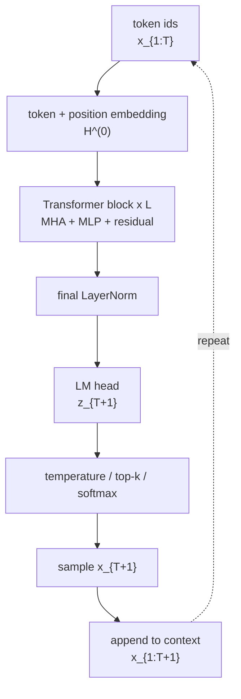

# nanoGPT Inference

nanoGPT Inference 是用 nanoGPT 的最小 GPT 实现来理解 decoder-only Transformer 推理流程：给定当前 token 序列 $x_{1:T}$，模型重新 forward 当前上下文窗口，得到下一个 token 的 logits，再经过 temperature / top-k / softmax 采样，并把采样结果 append 回序列继续循环。这个实现适合学习矩阵形状与自回归生成主干，但没有 [[KV Cache]]，因此不是生产级 LLM serving 的高效实现[^1]。

## Mechanism

### Overall Flow



推理循环可以写成：

$$
x_{T+1} \sim p_\theta(\cdot \mid x_{1:T})
$$

$$
x_{1:T+1} = (x_1, \dots, x_T, x_{T+1})
$$

nanoGPT 的 `generate()` 每一步都会先把上下文裁到 `block_size`，再调用一次完整 `forward()`，最后对 logits 做 temperature、top-k、softmax 和 multinomial sampling[^1]。

### Forward Pass

先把 token ids 和位置 ids 查表成向量：

$$
H^{(0)} = W_E[x_{1:T}] + W_P[1:T]
$$

以下 shape 都按单条序列写：

$$
x_{1:T} \in \mathbb{Z}^{T}, \quad
H^{(0)} \in \mathbb{R}^{T \times d_{\text{model}}}
$$

nanoGPT 代码中对应 `wte(idx)`、`wpe(pos)`，二者相加后进入 $L$ 个 Transformer block[^2]。

第 $\ell$ 层 block 是 pre-LN 结构：

$$
\bar{H}^{(\ell)}
= H^{(\ell-1)} + \mathrm{MHA}(\mathrm{LN}_1(H^{(\ell-1)}))
$$

$$
H^{(\ell)}
= \bar{H}^{(\ell)} + \mathrm{MLP}(\mathrm{LN}_2(\bar{H}^{(\ell)}))
$$

这里两个加号就是 residual stream：attention 和 MLP 都不是替换主干表示，而是往同一个 $H$ 里追加更新量[^3]。

> [!info] LayerNorm 的数学意义
> 对单个 token 的 hidden vector $h \in \mathbb{R}^{d_{\text{model}}}$，LayerNorm 先在特征维上计算均值和方差，再把每一维拉回稳定尺度：
> $$\mathrm{LN}(h)=\gamma \odot \frac{h-\mu}{\sqrt{\sigma^2+\epsilon}}+\beta$$
> 它不混合不同 token，只规范化同一个 token 内部各维特征的尺度。

![[Attachments/pics/nanogpt-layernorm-vector.png|560]]
*图：LayerNorm 对单个 token hidden vector 做中心化和尺度归一。*

### Causal Self-Attention

对单个 head，设输入为：

$$
H \in \mathbb{R}^{T \times d_{\text{model}}}
$$

投影得到：

$$
Q = HW^Q,\quad K = HW^K,\quad V = HW^V
$$

其中：

$$
W^Q, W^K, W^V \in \mathbb{R}^{d_{\text{model}} \times d_k}, \quad
Q,K,V \in \mathbb{R}^{T \times d_k}
$$

多头形式下，nanoGPT reshape 成：

$$
Q,K,V \in \mathbb{R}^{h \times T \times d_k}
$$

attention 分数矩阵是：

$$
\frac{QK^\top}{\sqrt{d_k}} \in \mathbb{R}^{h \times T \times T}
$$

causal mask 把未来位置遮掉：

$$
M_{ij} =
\begin{cases}
0, & j \le i \\
-\infty, & j > i
\end{cases}
$$

所以：

$$
\mathrm{Attention}(Q,K,V)
=
\mathrm{softmax}\left(\frac{QK^\top}{\sqrt{d_k}} + M\right)V
$$

> [!info] Softmax 的数学意义
> Softmax 把一组任意实数分数变成非负、总和为 1 的权重：
> $$\mathrm{softmax}(s_i)=\frac{\exp(s_i)}{\sum_j \exp(s_j)}$$
> 在 attention 里，每一行 softmax 都表示“当前位置应该从哪些历史 token 取信息”。被 causal mask 设为 $-\infty$ 的未来位置，softmax 后权重就是 0。

![[Attachments/pics/nanogpt-softmax-distribution.png|560]]
*图：Softmax 把未归一化 logits 变成概率分布。*

输出 shape 先是 $\mathbb{R}^{h \times T \times d_k}$，再 concat 回：

$$
\mathbb{R}^{T \times d_{\text{model}}}
$$

这就是 residual add 能成立的维度条件：attention 输出和输入 $H$ 的 shape 相同[^4]。

### MLP and LM Head

MLP 对每个 token 位置独立做两层线性变换[^5]：

$$
\mathrm{MLP}(H) = \mathrm{GELU}(H W_1) W_2
$$

> [!info] GELU 的数学意义
> GELU 可以写成 $\mathrm{GELU}(x)=x\Phi(x)$，其中 $\Phi(x)$ 是标准正态分布的 CDF。直觉上它是一个平滑 gate：大的正值大多通过，负值被压低，中间区域保留连续变化。

![[Attachments/pics/nanogpt-gelu-curve.png|560]]
*图：GELU 相比 ReLU 更平滑，负值区域不是硬截断。*

按 shape 看是：

$$
\mathbb{R}^{T \times d_{\text{model}}}
\rightarrow
\mathbb{R}^{T \times 4d_{\text{model}}}
\rightarrow
\mathbb{R}^{T \times d_{\text{model}}}
$$

所有 block 结束后，nanoGPT 做 final LayerNorm。推理时只对最后一个位置算 LM head：

$$
z_{T+1} = H_T^{(L)} W_U
$$

$$
z_{T+1} \in \mathbb{R}^{|\mathcal{V}|}
$$

然后：

$$
p_\theta(x_{T+1} \mid x_{1:T}) =
\mathrm{softmax}\left(\frac{z_{T+1}}{\tau}\right)
$$

其中 $\tau$ 是 temperature。top-k 会把非 top-k 的 logits 设为 $-\infty$，再进入 softmax[^1]。

> [!info] Temperature 和 top-k 的数学意义
> Temperature 是在 softmax 前缩放 logits：$\tau < 1$ 让分布更尖锐，$\tau > 1$ 让分布更平。top-k 则是在采样前缩小候选集合；它不改变 Transformer forward 的 hidden states，只改变最后如何从 logits 变成下一个 token。

![[Attachments/pics/nanogpt-temperature-topk.png|560]]
*图：Temperature 改变概率分布形状，top-k 直接裁掉候选 token。*

## Shape Ledger

| 符号 | shape | 直观含义 |
|---|---|---|
| $x_{1:T}$ | $T$ | 当前 token id 序列 |
| $H^{(\ell)}$ | $T \times d_{\text{model}}$ | 第 $\ell$ 层 residual stream |
| $Q,K,V$ | $h \times T \times d_k$ | 每个 head 的 query / key / value |
| $QK^\top$ | $h \times T \times T$ | 每个 token 看每个 token 的分数 |
| $\mathrm{MHA}(H)$ | $T \times d_{\text{model}}$ | attention 更新量，能加回 $H$ |
| $\mathrm{MLP}(H)$ | $T \times d_{\text{model}}$ | MLP 更新量，能加回 $H$ |
| $H_T^{(L)}$ | $d_{\text{model}}$ | 最后一个位置的 hidden state |
| $z_{T+1}$ | $|\mathcal{V}|$ | 下一个 token 的 logits |

## Implementation

nanoGPT 的推理伪代码可以压缩成：

```python
for _ in range(max_new_tokens):
    x = x[-block_size:]

    H = W_E[x] + W_P[positions]
    for block in transformer_blocks:
        H = H + mha(layer_norm_1(H))
        H = H + mlp(layer_norm_2(H))

    H = final_layer_norm(H)
    z = lm_head(H[-1])

    z = z / temperature
    z = top_k_filter(z)
    p = softmax(z)

    x_next = sample(p)
    x = concat(x, [x_next])
```

关键注意点：这段流程每步都重新计算当前窗口内所有 token 的 $Q,K,V$。因此它直观、短小，但没有 [[KV Cache]] 中的 prefill / decode 分离。

## Related

- [[Transformer]] —— nanoGPT 的模型主干来自 decoder-only Transformer
- [[KV Cache]] —— 生产推理中避免重复计算历史 token 的核心优化
- [[LLM Inference Optimization]] —— 从 serving 角度理解 prefill / decode、memory bound

[^1]: [nanoGPT/model.py:305-330](https://github.com/karpathy/nanoGPT/blob/3adf61e154c3/model.py#L305-L330)
[^2]: [nanoGPT/model.py:126-193](https://github.com/karpathy/nanoGPT/blob/3adf61e154c3/model.py#L126-L193)
[^3]: [nanoGPT/model.py:94-106](https://github.com/karpathy/nanoGPT/blob/3adf61e154c3/model.py#L94-L106)
[^4]: [nanoGPT/model.py:35-76](https://github.com/karpathy/nanoGPT/blob/3adf61e154c3/model.py#L35-L76)
[^5]: [nanoGPT/model.py:78-92](https://github.com/karpathy/nanoGPT/blob/3adf61e154c3/model.py#L78-L92)
