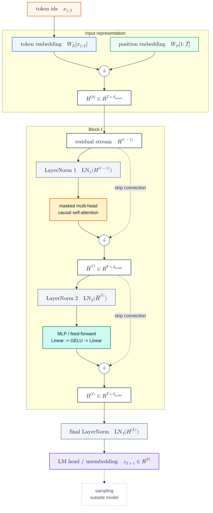

# nanoGPT Inference

nanoGPT Inference 是用 nanoGPT 的最小 GPT 实现来理解 decoder-only Transformer 推理流程：给定当前 token 序列 $x_{1:T}$^[读作“从第 1 到第 $T$ 个 token”；$T$ 是当前上下文长度。]，模型 forward 当前上下文窗口，得到下一个 token 的 logits，再经过 temperature / top-k / softmax 采样并 append 回序列。这个实现没有 [[KV Cache]]，因此每次生成都会重新计算当前窗口，不是生产级 LLM serving 的高效实现[^1]。

## Mechanism

### Model Structure



这张图只画一次 forward 的模型结构：embedding 得到 $H^{(0)}$^[这里 $H$ 表示所有位置的 hidden states 组成的矩阵；上标 $(0)$ 表示进入第一个 Transformer block 之前。]，$L$ 个 pre-LN Transformer block 沿 residual stream 写入 attention 和 MLP 更新，final LayerNorm 后经 LM head 得到 logits。

自回归生成发生在模型外部：

$$
x_{T+1} \sim p_\theta(\cdot \mid x_{1:T}), \quad
x_{1:T+1} = (x_1, \dots, x_T, x_{T+1})
$$

含义是：从模型给出的下一个 token 分布中采样，再把结果接到原序列末尾。^[$x_{T+1}$ 是下一个 token id；$p_\theta(\cdot \mid x_{1:T})$ 是参数为 $\theta$ 的模型给出的条件概率分布；$\sim$ 表示采样。]

nanoGPT 的 `generate()` 每步会截断到 `block_size`、调用一次 `forward()`、对最后 logits 采样[^1]。严格说，forward pass 不是模型组件，而是从 $x_{1:T}$ 到 $z_{T+1}$ 的整条模型调用；下面按这条调用里的组件拆解。

### Embedding and Residual Stream

先把 token ids 和位置 ids 查表成向量。$W_E$ 是 token embedding table，$W_P$ 是 position embedding table，$[\cdot]$ 表示查表取行：

$$
H^{(0)} = W_E[x_{1:T}] + W_P[1:T]
$$

以下 shape 都按单条序列写：

$$
x_{1:T} \in \mathbb{Z}^{T}, \quad
H^{(0)} \in \mathbb{R}^{T \times d_{\text{model}}}
$$

$d_{\text{model}}$ 是模型内部 hidden state 的宽度。^[$\mathbb{Z}^{T}$ 表示长度为 $T$ 的整数序列；$\mathbb{R}^{T \times d_{\text{model}}}$ 表示 $T$ 行、每行 $d_{\text{model}}$ 维的实数矩阵。]

nanoGPT 代码中对应 `wte(idx)`、`wpe(pos)`；二者相加后进入 $L$ 个 Transformer block[^2]。从这里开始，$H$ 是 residual stream：attention 和 MLP 都只是往这条主干上追加更新量。

第 $\ell$ 层 pre-LN block 写成：

$$
\bar{H}^{(\ell)}
= H^{(\ell-1)} + \mathrm{MHA}(\mathrm{LN}_1(H^{(\ell-1)}))
$$

$$
H^{(\ell)}
= \bar{H}^{(\ell)} + \mathrm{MLP}(\mathrm{LN}_2(\bar{H}^{(\ell)}))
$$

两个加号就是 residual connection：保留原表示，同时允许子层写入新信息。attention 负责写入历史 token 信息，MLP 负责改写每个 token 自己的特征[^3]。^[$\ell$ 是当前层编号；$\mathrm{LN}_1/\mathrm{LN}_2$ 是两个 LayerNorm；$\mathrm{MHA}$ 是 multi-head attention；$\bar{H}^{(\ell)}$ 是 attention 后、MLP 前的中间状态。]

> [!info]- LayerNorm
> **数学公式**：
> $$
> \mu=\frac{1}{d_{\text{model}}}\sum_{r=1}^{d_{\text{model}}}h_r,
> \quad
> \sigma^2=\frac{1}{d_{\text{model}}}\sum_{r=1}^{d_{\text{model}}}(h_r-\mu)^2
> $$
> $$
> \mathrm{LN}(\mathbf{h})=\gamma \odot \frac{\mathbf{h}-\mu}{\sqrt{\sigma^2+\epsilon}}+\beta
> $$
>
> **公式解释**：对单个 token 的 hidden vector $\mathbf{h} \in \mathbb{R}^{d_{\text{model}}}$，LayerNorm 在特征维上计算均值 $\mu$ 和方差 $\sigma^2$；$h_r$ 是向量 $\mathbf{h}$ 的第 $r$ 个特征，$\epsilon$ 是防止除零的数值稳定项，$\odot$ 表示逐元素乘法，$\gamma,\beta$ 是可学习的缩放和平移参数。
>
> **设计目的**：稳定 residual stream 里的特征尺度，但不混合不同 token 的信息。
>
> **图像参考**：
> ![[Attachments/pics/nanogpt-layernorm-vector.png|560]]
> *图：LayerNorm 对单个 token hidden vector 做中心化和尺度归一。*

### Causal Self-Attention

Causal self-attention 让每个位置读取自己和历史位置，同时禁止看未来。对单个 attention head，设输入为：

$$
H \in \mathbb{R}^{T \times d_{\text{model}}}
$$

投影得到 query / key / value：

$$
Q = HW^Q,\quad K = HW^K,\quad V = HW^V
$$

$$
W^Q, W^K, W^V \in \mathbb{R}^{d_{\text{model}} \times d_k}, \quad
Q,K,V \in \mathbb{R}^{T \times d_k}
$$

$Q,K,V$ 分别表示“当前位置想找什么”“历史位置提供什么索引”“最终被汇总的内容”。^[$W^Q,W^K,W^V$ 是三组线性投影参数；$d_k$ 是单个 head 的向量维度。]

多头时 reshape 成：

$$
Q,K,V \in \mathbb{R}^{h \times T \times d_k}
$$

其中 $h$ 是 head 个数，即 nanoGPT 里的 `n_head`。attention 分数矩阵是：

$$
\frac{QK^\top}{\sqrt{d_k}} \in \mathbb{R}^{h \times T \times T}
$$

causal mask 把未来位置遮掉：

$$
M_{ij} =
\begin{cases}
0, & j \le i \\
-\infty, & j > i
\end{cases}
$$

所以完整 attention 是：

$$
\mathrm{Attention}(Q,K,V)
=
\mathrm{softmax}\left(\frac{QK^\top}{\sqrt{d_k}} + M\right)V
$$

这里 $QK^\top$ 的第 $(i,j)$ 个元素表示第 $i$ 个位置看第 $j$ 个位置的匹配分数；mask 里的 $i$ 是当前正在更新的位置，$j$ 是被读取的位置。

> [!info]- Softmax
> **数学公式**：
> $$
> \mathrm{softmax}(s)_i=\frac{\exp(s_i)}{\sum_{j=1}^{n}\exp(s_j)}
> $$
>
> **公式解释**：Softmax 把分数向量 $s \in \mathbb{R}^{n}$ 变成非负、总和为 1 的权重向量；$s_i$ 是第 $i$ 个候选的分数，$n$ 是候选数量。在 attention 里，$n=T$，每一行权重表示当前位置应该从哪些历史 token 取信息。
>
> **设计目的**：把相似度分数转成可加权求和的概率权重；被 causal mask 设为 $-\infty$ 的未来位置，softmax 后权重为 0。
>
> **图像参考**：
> ![[Attachments/pics/nanogpt-softmax-distribution.png|560]]
> *图：Softmax 把未归一化 logits 变成概率分布。*

输出 shape 先是 $\mathbb{R}^{h \times T \times d_k}$，再 concat 回：

$$
\mathbb{R}^{T \times d_{\text{model}}}
$$

这就是 residual add 能成立的维度条件：attention 输出和输入 $H$ 的 shape 相同[^4]。

### MLP

MLP 不混合不同位置，只在每个 token 内部做升维、激活、再降维[^5]：

$$
\mathrm{MLP}(H) = \mathrm{GELU}(H W_1) W_2
$$

$W_1$ 把 hidden state 从 $d_{\text{model}}$ 维升到 $4d_{\text{model}}$ 维，$W_2$ 再投回 $d_{\text{model}}$ 维：

$$
\mathbb{R}^{T \times d_{\text{model}}}
\rightarrow
\mathbb{R}^{T \times 4d_{\text{model}}}
\rightarrow
\mathbb{R}^{T \times d_{\text{model}}}
$$

> [!info]- GELU
> **数学公式**：
> $$
> \mathrm{GELU}(x)=x\Phi(x)
> $$
>
> **公式解释**：这里的 $x$ 是 MLP 中某一维的 scalar activation，$\Phi(x)$ 是标准正态分布的 CDF，因此 GELU 可以理解为用一个随 $x$ 平滑变化的门控系数来保留或压低输入。
>
> **设计目的**：给 MLP 引入非线性，同时避免 ReLU 那种硬截断；大的正值大多通过，负值被压低，中间区域保留连续变化。
>
> **图像参考**：
> ![[Attachments/pics/nanogpt-gelu-curve.png|560]]
> *图：GELU 相比 ReLU 更平滑，负值区域不是硬截断。*

### LM Head

所有 block 结束后，nanoGPT 做 final LayerNorm。推理时只取最后一个位置做 LM head，把 hidden state 投到词表空间：

$$
z_{T+1} = H_T^{(L)} W_U
$$

$$
W_U \in \mathbb{R}^{d_{\text{model}} \times |\mathcal{V}|}, \quad
z_{T+1} \in \mathbb{R}^{|\mathcal{V}|}
$$

$H_T^{(L)}$ 是最后一层输出的第 $T$ 行，$W_U$ 是 unembedding / LM head 权重，$|\mathcal{V}|$ 是词表大小。$z_{T+1}$ 是 logits 向量，每一维对应一个候选 token 的未归一化分数。

### Sampling

Sampling 是模型外部的解码步骤：它把 LM Head 输出的 logits 变成一个具体 token。采样分布写成：

$$
p_\theta(x_{T+1} \mid x_{1:T}) =
\mathrm{softmax}\left(\frac{z_{T+1}}{\tau}\right)
$$

其中 $\tau$ 是 temperature；top-k 会把非 top-k 的 logits 设为 $-\infty$，再进入 softmax[^1]。

> [!info]- Temperature / top-k
> **数学公式**：
> $$
> z_i' =
> \begin{cases}
> z_i, & i \in \mathrm{TopK}(z,k) \\
> -\infty, & i \notin \mathrm{TopK}(z,k)
> \end{cases}
> $$
> $$
> p_i=\frac{\exp(z_i'/\tau)}{\sum_j \exp(z_j'/\tau)}
> $$
>
> **公式解释**：$z_i$ 是第 $i$ 个词表项的 logit，$z_i'$ 是 top-k 过滤后的 logit，$\mathrm{TopK}(z,k)$ 返回 logits 最大的 $k$ 个词表项索引。top-k 先只保留这些候选 token，temperature $\tau$ 再控制 softmax 前的缩放强度。
>
> **设计目的**：控制采样行为，而不是改变 Transformer forward 的 hidden states；$\tau < 1$ 让分布更尖锐，$\tau > 1$ 让分布更平，top-k 则直接缩小候选集合。
>
> **图像参考**：
> ![[Attachments/pics/nanogpt-temperature-topk.png|560]]
> *图：Temperature 改变概率分布形状，top-k 直接裁掉候选 token。*

## Implementation

nanoGPT 的推理伪代码可以压缩成：

```python
for _ in range(max_new_tokens):
    x = x[-block_size:]

    H = W_E[x] + W_P[positions]
    for block in transformer_blocks:
        H = H + mha(layer_norm_1(H))
        H = H + mlp(layer_norm_2(H))

    H = final_layer_norm(H)
    z = lm_head(H[-1])

    z = z / temperature
    z = top_k_filter(z)
    p = softmax(z)

    x_next = sample(p)
    x = concat(x, [x_next])
```

关键注意点：这段流程每步都重新计算当前窗口内所有 token 的 $Q,K,V$。因此它直观、短小，但没有 [[KV Cache]] 中的 prefill / decode 分离。

## Related

- [[Transformer]] —— nanoGPT 的模型主干来自 decoder-only Transformer
- [[KV Cache]] —— 生产推理中避免重复计算历史 token 的核心优化
- [[LLM Inference Optimization]] —— 从 serving 角度理解 prefill / decode、memory bound

[^1]: [nanoGPT/model.py:305-330](https://github.com/karpathy/nanoGPT/blob/3adf61e154c3/model.py#L305-L330)
[^2]: [nanoGPT/model.py:126-193](https://github.com/karpathy/nanoGPT/blob/3adf61e154c3/model.py#L126-L193)
[^3]: [nanoGPT/model.py:94-106](https://github.com/karpathy/nanoGPT/blob/3adf61e154c3/model.py#L94-L106)
[^4]: [nanoGPT/model.py:35-76](https://github.com/karpathy/nanoGPT/blob/3adf61e154c3/model.py#L35-L76)
[^5]: [nanoGPT/model.py:78-92](https://github.com/karpathy/nanoGPT/blob/3adf61e154c3/model.py#L78-L92)
